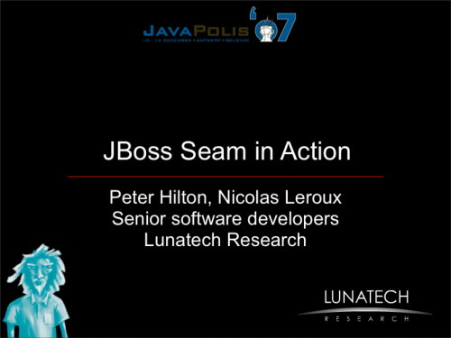

This week Peter Hilton
and Nicolas Leroux, senior software developers at Lunatech Research,
presented http://www.javapolis.com/confluence/display/JP07/Seam+in+Action[Seam In
Action]
at http://www.javapolis.com/[JavaPolis] in Antwerp.

You can download the link:javapolis-2007-seam.pdf[presentation slides]
(PDF, 2.6 Mb).
