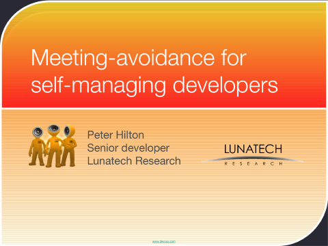

This week, Peter Hilton will be
presenting http://www.devoxx.com/display/JV08/Meeting-avoidance+for+self-managing+developers[Meeting-avoidance for self-managing
developers]
at Devoxx in Antwerp. With 3200 attendees, Devoxx is the world's biggest
vendor-independent Java conference, and a key event for European Java
developers.

link:meeting-avoidance.pdf[Slides] (PDF, 1.6 MB)

