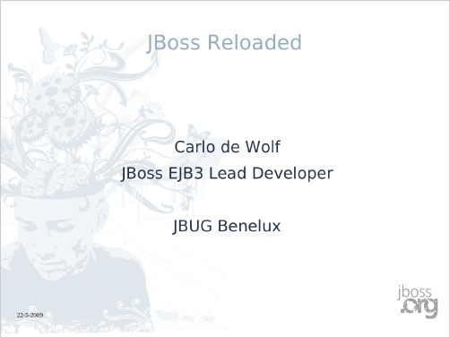
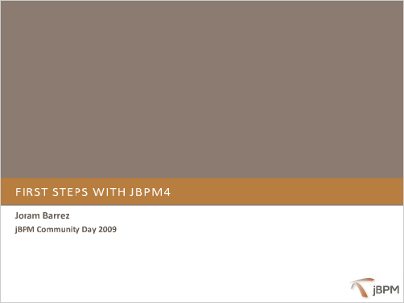

Last Friday’s Benelux JBoss User Group was
well-attended, and the weather played along with our plan to have a
barbeque and drinks outside in the garden at the Lunatech office in
Rotterdam. Here are the slides for the three presentations.

{empty}1. link:Reloaded-20090522.pdf[JBoss Reloaded] (PDF, 240 Kb):

{empty}2.
http://www.slideshare.net/jorambarrez/presentation-jbpm-community-day-2009-first-steps-with-jbpm4?type=powerpoint[First steps with jBPM4] (slideshare.net):

{empty}3. link:Localisation_-_JBug_22_May_2009.pdf[Language localisation in Java, JSF and Seam] (PDF, 984 Kb):

