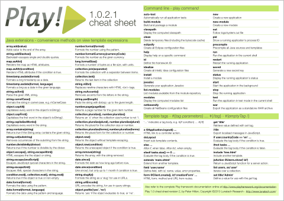

---
tags:
- "playframework"
- "java"
---
= Play framework 1.0 cheat sheet
PeterHilton
v1.0, 2010-06-08

Now that you are getting started with the
http://www.playframework.org/[Play framework] 1.0, you need a handy
quick reference. Here is a link:play-cheat-sheet.pdf[Play framework cheat
sheet] (A4 PDF, 53 KB), with the essential
commands, tags and extensions." ---

If you want to know why we like Play, then read about
link:https://blog.lunatech.com/posts/2010-03-15/play-framework-usability[Play framework usability].
