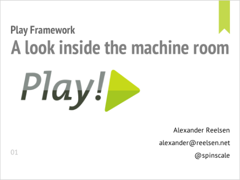
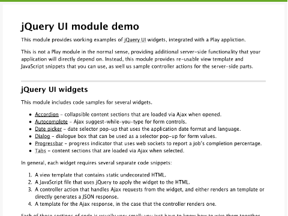
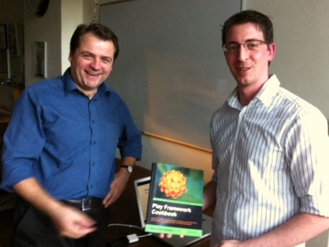

On
30 September 2011, Lunatech hosted the second Play!ground event for
http://www.playframework.org/[Play framework] users. Here are the
slides and source code from the presentations.

== A look inside the machine room

Alexander Reelsen.
http://spinscale.github.com/play-advanced-concepts.html[slides] (HTML)

== jQuery UI module

Peter Hilton, Lunatech. https://github.com/hilton/jqueryui-module[source code] (GitHub)

== Gratuitous book promotion

Peter Hilton (left) also took the opportunity to get Alexander Reelsen
(right) to autograph his copy of the
https://blog.lunatech.com/posts/2011-09-19-playframework-cookbook-review[Play Framework Cookbook].

