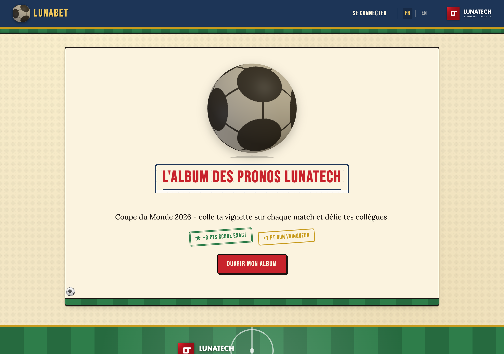
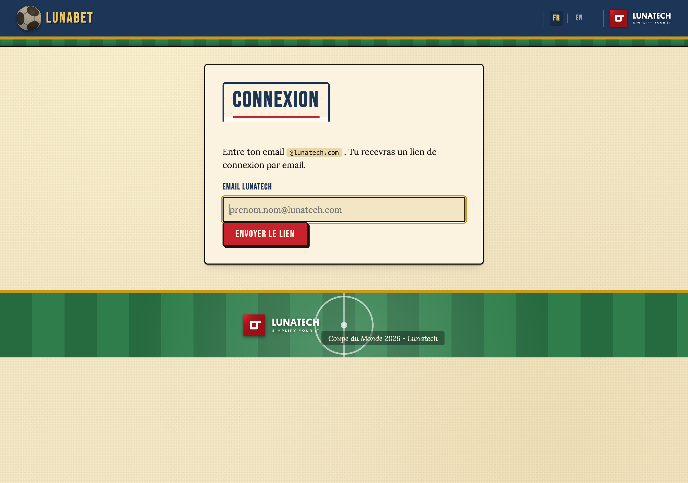
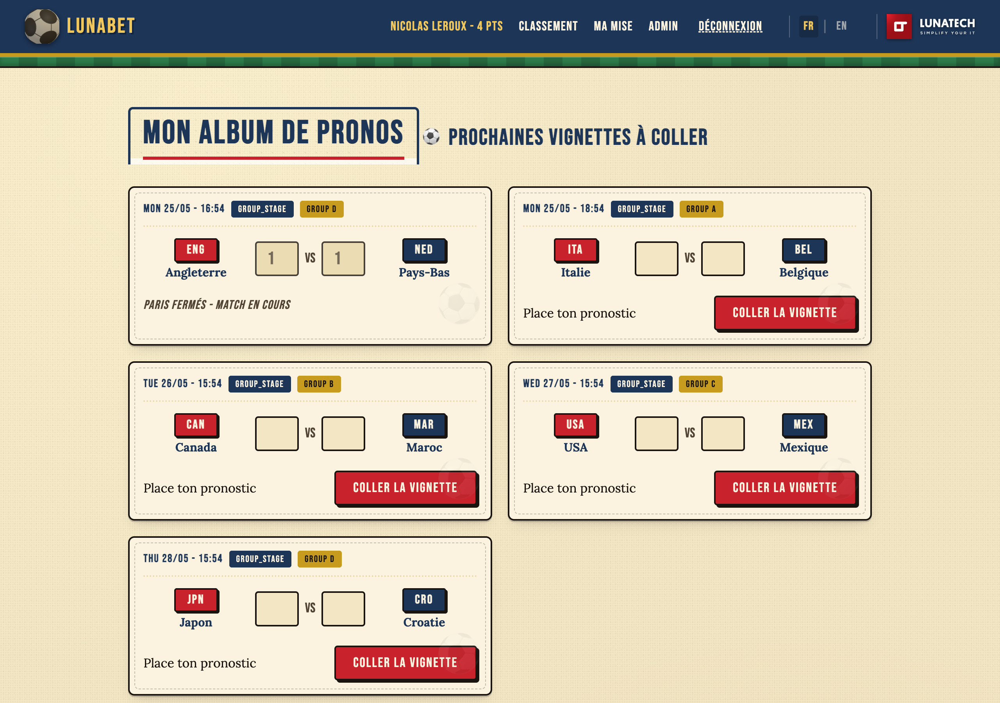
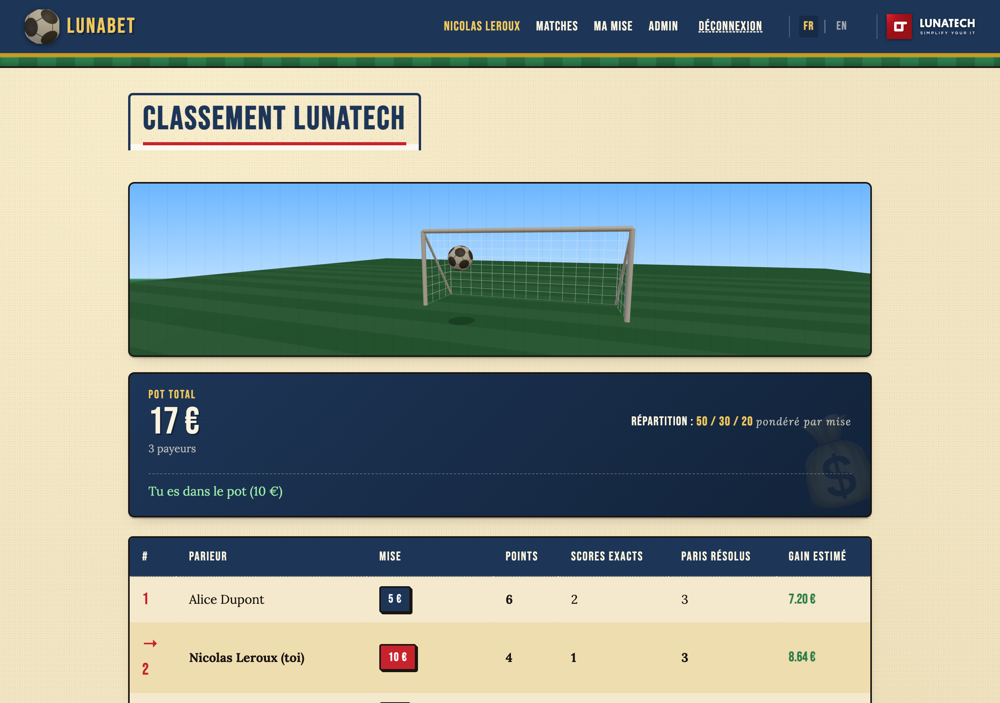
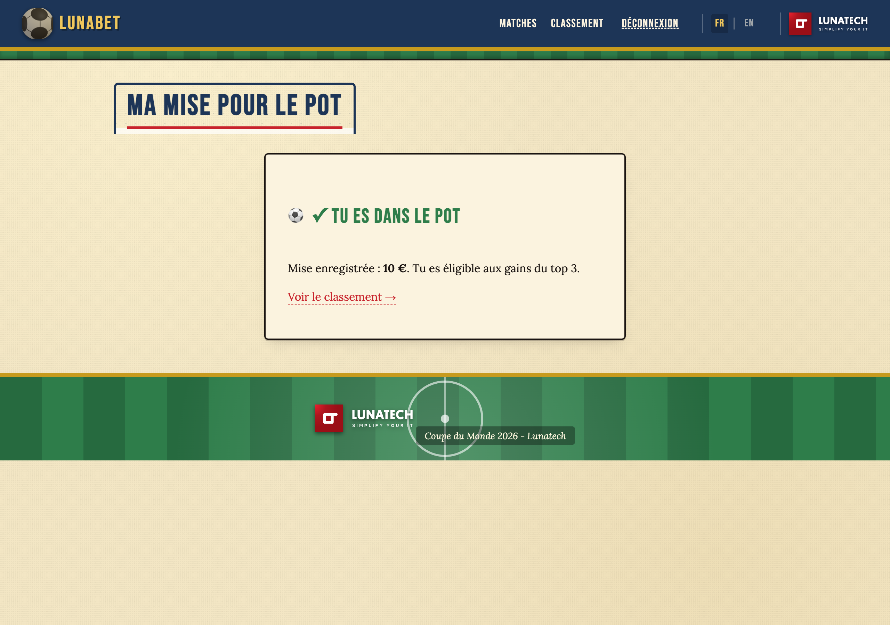
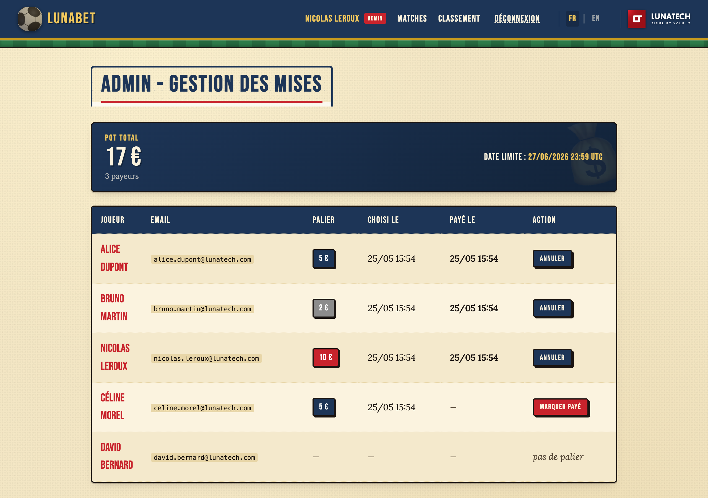
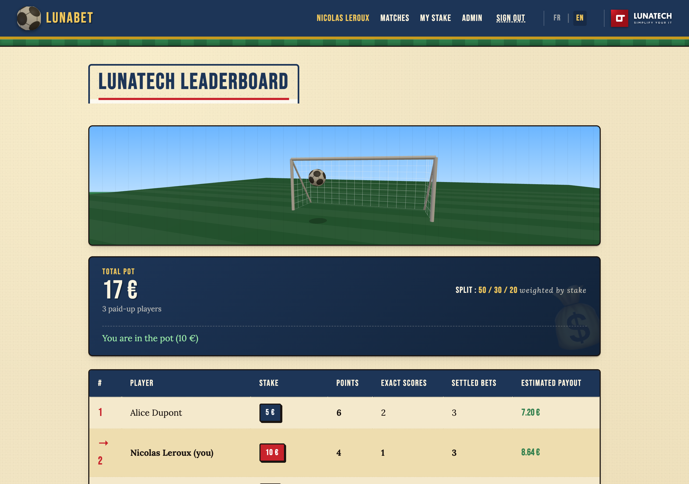
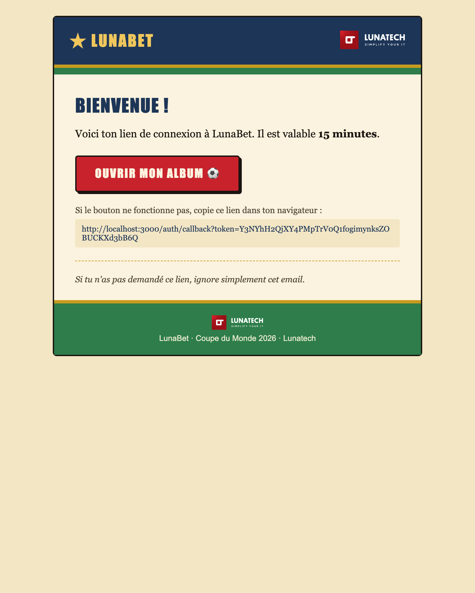
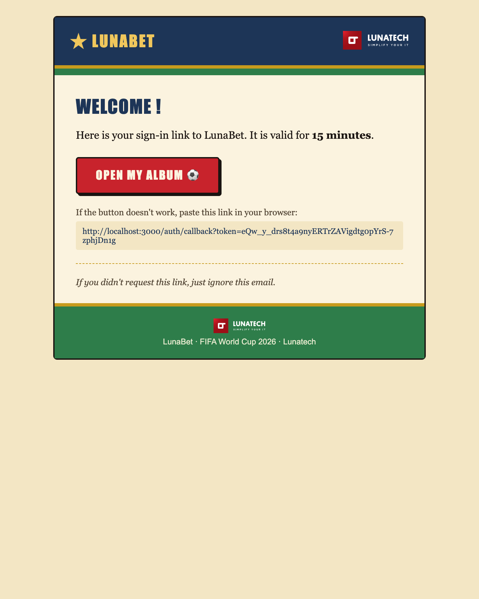
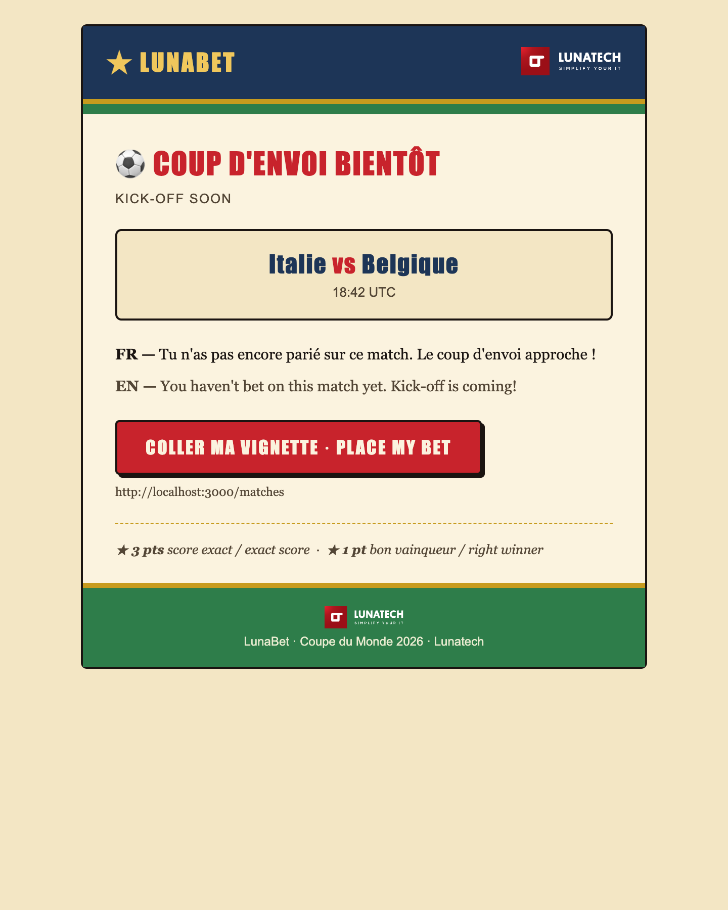

= LunaBet: shipping a Panini-style World Cup pool in Rust, in an afternoon
pepite
v1.0, 2026-05-30
:title: LunaBet: shipping a Panini-style World Cup pool in Rust, in an afternoon
:lang: en
:tags: [rust, axum, htmx, three.js, world cup, side project, ai orchestration, en]

Every four years the same conversation happens in our Lunatech Slack: who is going to run the office pool for the World Cup? Every four years someone says "I will do it in a spreadsheet", and every four years that spreadsheet ends up as a corrupted Google Sheet with three formulas fighting over the same cell. So this time, between two cups of coffee, I decided to build the thing properly. The result is https://lunabet.eu[LunaBet], and the Lunatech-internal instance lives at https://lunatech.lunabet.eu[lunatech.lunabet.eu].

== The story in one sentence

LunaBet is a small multi-tenant betting app for the FIFA World Cup 2026. Pick the exact score of every match, score points (3 for the exact score, 1 for the right winner), climb the leaderboard, optionally chip in 2, 5 or 10 euros to a shared pot that the top 3 split at the end of the group stage. There is one twist: the whole thing is themed like a Panini sticker album that took a wrong turn through a https://en.wikipedia.org/wiki/Captain_Tsubasa[Captain Tsubasa] rerun, with the obligatory _"the ball is your friend"_ quote from Olivier Atton.

== Multi-tenant by design

The interesting bit is that LunaBet is not a single-tenant Lunatech tool. Any organization can sign up at https://lunabet.eu[lunabet.eu], pick a slug, and immediately get their own branded space at `<slug>.lunabet.eu`. The only restriction is that your colleagues have to sign in with an email that matches your organization's domain, which keeps the pool internal without any user management on your side. Lunatech itself is just one of many possible tenants: `lunatech.lunabet.eu` is for people with an `@lunatech.com` email, but a friend in another shop can spin up `acme.lunabet.eu` for `@acme.com` in less than a minute.

== Tour of the app

The login flow is a magic link, so there are no passwords to remember and no SSO to configure. Type your work email, click the link, and you are in.

The matches page is the place where you spend most of your time during the tournament. Each match is a Panini-style sticker card with the two flags, the kick-off time, and a tiny inline form to predict the score. Bets close at kick-off, so no insider trading once the players are on the pitch.

The leaderboard updates automatically as soon as a match is final. The 3D goal-shot scene at the top is rendered in the browser with Three.js, full goal cage with posts, crossbar and a translucent net, a parabolic top-corner shot, a flash and a bounce, the whole thing looping every few seconds. It is gratuitous and we love it.

If you want skin in the game, you can join the pot for 2, 5 or 10 euros. The app never touches the money: you Lydia or bank-transfer the admin, the admin marks you as paid, and the pot is shared between the top three paid players at the end of the group stage. Higher stakes get a bigger slice of their position's share, which means a 10 euro player in third still walks away with something interesting.

Admins get a small back office to mark payments as received and to settle the pot.

Everything is bilingual, French and English, switchable from the topbar. The leaderboard in English looks like this:

The transactional emails follow the same theme: navy header, a striped pitch, a red _stamp_ button. Magic-link emails are localized to the visitor's language at request time, while match reminders are bilingual side by side because we do not store a per-user language.

== The stack, and why

The codebase is intentionally boring. The whole app is one Rust binary built with Axum, with templates compiled into the binary via Askama, htmx for the tiny bits of client interactivity, Three.js loaded from a CDN for the 3D ball, and lettre for the SMTP side of magic links and reminders. Persistence is PostgreSQL through SQLx, with migrations applied at startup so deployment is just _drop the binary and restart_. Match fixtures and results are pulled from https://www.football-data.org[football-data.org] every five minutes, which is also when the reminder job fires.

That last point is more interesting than it sounds: football-data.org exposes hundreds of competitions behind a single competition code, so spinning up a pool for a new tournament is essentially a one-line change. `FOOTBALL_DATA_COMPETITION=WC` gives you the World Cup, `EC` gives you the Euros, `CL` the Champions League, `PL` the Premier League, and so on. Restart the binary and the fixtures, results and reminders for the next competition flow in on their own. The Panini sticker theme and the scoring rules do not care which tournament is in season, so the same instance can be repurposed for whatever your team wants to bet on next.

Rust was not a bet, it was the path of least resistance. A single statically linked binary, no runtime to install on the server, no garbage collection pauses to worry about, and the type system catches the kind of off-by-one mistakes that ruin scoring logic when you are coding at 11 pm. Axum and SQLx are mature enough that you spend zero time fighting the framework and all your time on the actual problem, which in our case was "make exact-score betting fun".

== How fast can you actually ship?

LunaBet is also, quietly, an example of the kind of "orchestrating, not coding" story I https://blog.lunatech.com/posts/2026-05-19-from-coding-to-orchestrating[wrote about a few weeks ago]. The first usable version, with magic links, scoring, leaderboard, fixtures sync and emails, came together in a single afternoon and an evening. Not because the AI did it, and not because I am particularly fast at Rust, but because the context was right: a clean problem statement, a target stack chosen up front, a Panini moodboard pinned to the brief, and a tight feedback loop between writing and testing. The model wrote a lot of the scaffolding. I wrote the rules, the constraints, and the look. Then I read every line.

The multi-tenant work, the per-org branding, the bilingual emails and the dev-mode one-click sign-in came in a second pass once the core was solid. Same recipe: small, well-scoped tasks; verify each output; commit when green.

== Try it

If your team has been threatening to redo The Spreadsheet, just send them to https://lunabet.eu[lunabet.eu]. Pick a slug, confirm by email, and your office pool is live before the kick-off of the opener. The code is open source under Apache 2.0 at https://github.com/lunatech-labs/lunatech-lunabet[github.com/lunatech-labs/lunatech-lunabet] if you would rather self-host or fork it.

One legal note before you do: a real-money pool between colleagues, even when settled outside the app on the honor system, can fall under your local gambling regulation. In France it is the ANJ. Run the idea past HR or legal before any public rollout. LunaBet never touches the money, which limits exposure, but it does not eliminate it.

'''

_Contact: nicolas.leroux@lunatech.com | https://lunatech.com[lunatech.com]_
