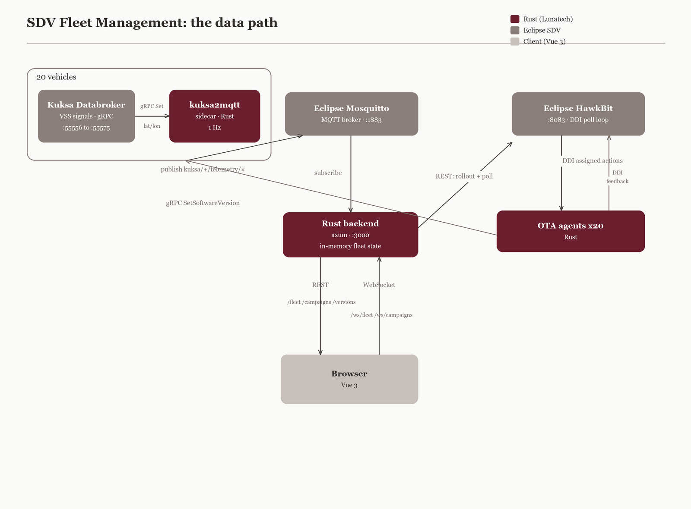
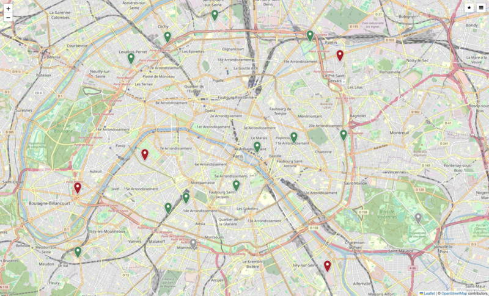

= The software-defined vehicle moves the work to the backend
peutit
v2.0, 2026-06-10
:title: The software-defined vehicle moves the work to the backend
:lang: en
:tags: [eclipse-sdv, rust, kuksa, hawkbit, mqtt, axum, software-defined-vehicle, open-source]

A modern car is a computer that happens to have wheels. The interesting code no longer lives in the engine bay. It lives on a server, talking to the vehicle over the network, deciding what the fleet knows and what each car runs next. The industry calls this the software-defined vehicle. The name hides where the real engineering goes: into the backend.

We built a working demo to make that point concrete. It manages a fleet of twenty vehicles. Live GPS positions flow from each car to a map in the browser. Software updates roll out over the air from a panel in the UI. The whole thing starts with one `docker compose up` and runs on a laptop.

It is open source. You can read the code here: https://github.com/lunatech-labs/sdv-fleet-management[lunatech-labs/sdv-fleet-management]. This post walks the data path end to end, then explains why the server side is written in Rust.

== The shape of the system

The architecture is a pipeline. Vehicle state originates in per-vehicle Eclipse Kuksa Databrokers, crosses an Eclipse Mosquitto MQTT broker, lands in a Rust backend, and reaches the browser over a WebSocket. Over-the-air campaigns run on a parallel track through Eclipse HawkBit down to per-vehicle update agents.

Three Eclipse SDV projects do the heavy lifting, and we adopted them rather than inventing private equivalents. Kuksa holds vehicle state. HawkBit runs the update campaigns. Mosquitto moves the messages. Building on an open ecosystem in the open is itself a form of contribution, and it is the honest first step toward upstream work.

== Stage one: Kuksa and the Vehicle Signal Specification

Each of the twenty cars runs its own Kuksa Databroker. A Databroker is a small gRPC service that holds the current value of a vehicle's signals, addressed by the Vehicle Signal Specification (VSS). VSS is a tree. A position is not a bespoke field, it is `Vehicle.CurrentLocation.Latitude` and `Vehicle.CurrentLocation.Longitude`. Identity is `Vehicle.VehicleIdentification.VIN`, `.Brand`, `.Model`.

The contract is gRPC, so the signals are typed and discoverable. You can read a signal straight from a broker with `grpcurl`:

[source,bash]
----
grpcurl -plaintext \
  -d '{"entries":[{"path":"Vehicle.CurrentLocation.Latitude","fields":["FIELD_VALUE"]}]}' \
  localhost:55556 kuksa.val.v1.VAL/Get
----

Twenty brokers means twenty independent sources of truth, one per VIN, each listening on its own port. That mirrors reality: a fleet is not one database, it is many vehicles that each know their own state.

== Stage two: the sidecar that bridges gRPC to MQTT

Kuksa speaks gRPC. The rest of the pipeline speaks MQTT. Something has to bridge the two, and that is the `kuksa2mqtt` sidecar, written in Rust, one instance per vehicle.

The sidecar is the source of each car's movement. It runs a GPS random walk, writes the new latitude and longitude into the Databroker over gRPC once per second, and publishes the same pair to MQTT on a per-vehicle topic. Identity is different. VIN, brand, and model do not change, so the sidecar publishes them once at startup. The topic structure carries the VIN and the VSS path, so a subscriber can filter exactly what it wants:

[source]
----
kuksa/VIN-0001/telemetry/CurrentLocation/Latitude    48.8571
kuksa/VIN-0001/telemetry/CurrentLocation/Longitude   2.3529
kuksa/VIN-0001/telemetry/VehicleIdentification/Brand Toyota
----

This is a deliberate seam. The backend never talks gRPC to the cars. It subscribes to one wildcard topic and lets the broker fan in the whole fleet. Adding a vehicle means starting another Databroker and another sidecar. The backend code does not change.

== Stage three: the axum backend

The backend is an axum service on port 3000. On startup it subscribes to a single wildcard:

[source]
----
kuksa/+/telemetry/#
----

The `+` matches any VIN, the `#` matches any signal path below it. One subscription, the entire fleet. As messages arrive the backend updates an in-memory view of fleet state, keyed by VIN. There is no database in the hot path. The current position of a car is a value in a map, protected for concurrent access, updated as fast as MQTT delivers.

The REST surface is thin and predictable:

[source]
----
GET  /fleet                 snapshot of all vehicles
GET  /vehicles/{vin}        one vehicle
GET  /versions              available software versions
GET  /campaigns             campaign list and state
POST /campaigns             launch a rollout
----

The handler signatures read the way axum encourages: typed extractors in, typed responses out. Launching a campaign takes a body with a target version and a list of VINs, and returns the created campaign or a typed error.

[source,rust]
----
#[derive(Debug, Deserialize, ToSchema)]
pub struct CreateCampaign {
    pub version: String,
    pub vins: Vec<String>,
}

pub async fn create_campaign(
    State(state): State<AppState>,
    Json(req): Json<CreateCampaign>,
) -> Result<Json<Campaign>, (StatusCode, Json<ApiError>)> {
    // start the HawkBit rollout, fold it into campaign state, return the record
}
----

The `ToSchema` derive is not decoration. It is what feeds the OpenAPI generator, and we will come back to it.

The browser does not poll for live data. It asks once over REST for the initial snapshot, then opens a WebSocket and listens. The frames are small Rust types serialised to JSON. The position event is exactly three fields:

[source,rust]
----
#[derive(Debug, Clone, Serialize, Deserialize, ToSchema)]
pub struct PositionEvent {
    pub vin: String,
    pub lat: f64,
    pub lon: f64,
}
----

On the wire the two streams look like this:

[source]
----
// /ws/fleet
{"vin":"VIN-0003","lat":48.8641,"lon":2.3318}

// /ws/campaigns
{"campaign_id":"...","vin":"VIN-0001","state":"Installing"}
----

The map moves because the server tells it to, not because it keeps asking. This is the single most important property of the read path: state changes are pushed, never polled, and the wire format is small enough to be obvious at a glance.

== The OTA track: HawkBit and a state machine per vehicle

Updates run on their own path. When you launch a campaign from the UI, the backend asks HawkBit to start a rollout for the chosen version and target VINs. HawkBit owns the Direct Device Integration (DDI) protocol: each OTA agent, one per vehicle and written in Rust, polls HawkBit for assigned actions, downloads, installs, and reports progress.

Every vehicle moves through its own state machine:

[source]
----
Pending -> Downloading -> Installing -> Complete
                                     -> Failed
----

The agent reports each transition to HawkBit over DDI. The backend polls HawkBit for progress, folds it into campaign state, and pushes it to the UI over the WebSocket, where the map marker changes colour. Two tracks reach the same screen: telemetry arrives over MQTT, campaign state comes from HawkBit. Neither is polled by the browser.

One detail we kept on purpose: every OTA agent fails its update twenty percent of the time, deliberately. A demo that always succeeds teaches nothing about the system you would actually run. Real fleets have cars with bad connections and interrupted downloads. The interesting code is the code that handles the unhappy path. So some markers turn red, the agent reports the failure to HawkBit, and the state machine records it instead of pretending the rollout went clean. A rollout you can trust is one that tells you when it breaks.

== Why Rust on the server

The data path from car to screen is Rust from end to end: the sidecars, the backend, the update agents. That is not an accident. The reasons are concrete.

Concurrency without surprises. The backend holds shared fleet state while MQTT messages, REST requests, and WebSocket pushes all touch it at once. Rust's ownership model turns the data races you would chase at runtime in another stack into compile errors. The borrow checker is doing fleet-state integrity for free.

Typed integration boundaries. Every seam in this system is a place where a wrong assumption costs you. A VSS path, an MQTT payload, a HawkBit response, a JSON frame on the wire. Modelling each as a Rust type means a malformed message fails at the edge, with a clear error, instead of propagating a bad value toward a vehicle.

A small, predictable footprint. axum on Tokio gives an async runtime with no garbage collector pauses and a memory profile flat enough to run twenty sidecars, twenty agents, and a backend on a laptop without thinking about it.

The API contract cannot drift. The OpenAPI specification is generated directly from the Rust source with `utoipa`: the same `#[derive(ToSchema)]` on a type and the `#[utoipa::path(...)]` attribute on a handler that the compiler checks are what produce the spec. The Swagger explorer at `/docs` is never out of date with the running server, because there is no second source of truth to fall out of sync. The types that define the handlers are the types that define the spec.

[source,bash]
----
open http://localhost:3000/docs   # generated from the Rust source
----

== How it was built

We built this with Claude as a coding partner. The repository carries its working context in a file at the root, so the assistant understood the architecture, the conventions, and the constraints on every session. The result is not a prototype held together by hand. The Rust side runs `cargo fmt`, `cargo clippy -- -D warnings`, and `cargo test` on every push. The frontend lints and unit-tests. A Playwright end-to-end suite drives the full stack. All of it runs in continuous integration.

That is the part worth noting for anyone weighing AI-assisted development. The leverage is real, but it shows up as discipline, not shortcuts. The tests, the generated API contract, and the clean separation between services are what let a small team move fast without leaving a mess behind.

== See it run

Twenty vehicle pins are spread across Paris, each moving on its own at one update per second. Green pins are up to date, red pins are out of date or have a campaign in progress.

A full walkthrough: the live map, the vehicle drawer, the fleet table, an over-the-air campaign launch, and the state updates landing in real time.

++++
<iframe width="960" height="540" src="https://www.youtube.com/embed/HokMqkx5VmI" frameborder="0" allow="accelerometer; autoplay; clipboard-write; encrypted-media; gyroscope; picture-in-picture" allowfullscreen></iframe>
++++

== Run it yourself

[source,bash]
----
git clone git@github.com:lunatech-labs/sdv-fleet-management.git
cd sdv-fleet-management
cp .env.example .env   # set HAWKBIT_TOKEN, HAWKBIT_USER, HAWKBIT_PASSWORD
docker compose up
----

Open the map at `http://localhost:8080`. Twenty cars move across Paris at one update per second. Click one to read its VIN, brand, model, and software version, all served from the single `/fleet` snapshot. Launch a campaign and watch the markers change colour as each vehicle walks its own state machine. Open a second terminal and `websocat ws://localhost:3000/ws/fleet` to read the raw frames the browser is consuming.

The software-defined vehicle is a backend problem wearing a car. The Eclipse SDV projects give the industry a shared foundation to build on. We are building on it, in the open, and we would rather show the work than describe it.
