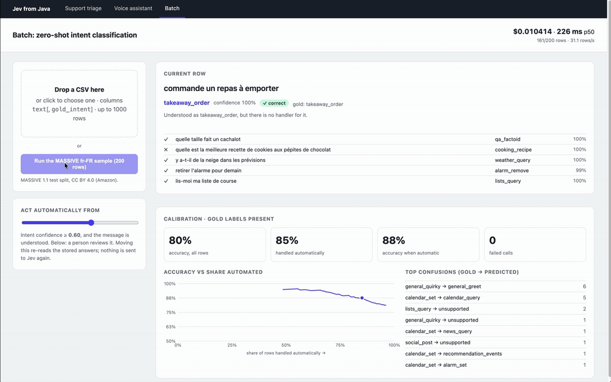
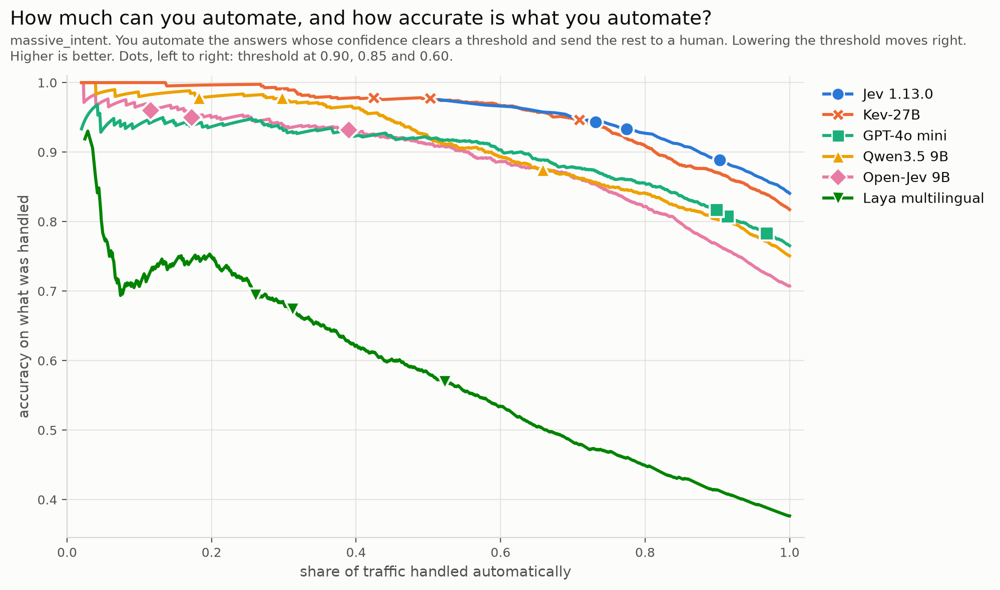

:lang: en

When TypeSafe launched *Jev* in mid-September 2026, it sparked immediate interest across Reddit, YouTube, and developer forums. Promoted as a "System 1" model that evaluates structured, typed questions against free-text inputs without generating text, Jev promises fast (I measured ~300–500ms per call from France), cheap ($0.042 / 1M input tokens), and guaranteed schema-compliant decisions.

As a developer, I wanted to cut through the marketing claims and answer four practical questions:

. *How does Jev work under the hood?*
. *How does it hold up in French compared to English?*
. *How does it compare against open alternatives and general LLMs?*
. *Is it actually ready for software production boundaries?*

To find out, I built an empirical benchmark (https://github.com/4nt0ineB/typed-decision-bench[`typed-decision-bench`]) testing 15 models on real datasets, and created a Java demonstration web application (https://github.com/4nt0ineB/jev-from-java[`jev-from-java`]) to explore production patterns.

Here is what I learned.

---

== 1. The developer’s dilemma at system boundaries

Most software automation tasks at application boundaries don't require open-ended conversation or creative drafting. They involve small, closed decisions:

* _Which department should handle this support ticket?_
* _Is this customer request urgent?_
* _Which intent matches this user voice command?_
* _Does this loan application satisfy eligibility rule X?_

Until now, software teams faced two main choices:

[cols="a,a,a",options="header"]
|===
| Approach | Pros | Cons
| *Traditional ML / encoders* _(e.g., BERT, XLM-R)_ | Fast, cheap at runtime, high accuracy on fixed domains. | Heavy MLOps pipeline overhead: manual dataset labeling, retraining loops, hosting, and monitoring.
| *Generative LLMs* _(e.g., GPT-4o mini, Claude)_ | Works on day 1 with zero training data. | ~1s latency per call, high token cost, text output you have to constrain or parse, and poorly calibrated confidence scores.
|===

*Typed decision models* bridge this gap. You feed the model a state (e.g., a customer email, a voice command, or an 11-page document) alongside a list of strongly typed questions (`Choice`, `Score`, `Noul`). Instead of generating tokens, the model answers all the questions in one call and returns probabilities and a confidence score in strict JSON.

Here are four questions on one message, answered in a single call (~250ms):

[source,json]
----
{
  "model": "jev-1.13.0",
  "state": "Hello, I've been waiting three weeks for the refund on my claim. If nothing happens, I'll take it to the mediator.",
  "questions": {
    "department": {
      "type": "choice",
      "instructions": "Which team should handle this",
      "criteria": {
        "billing": "Payment, premium, refund or invoice issue",
        "claims": "Reporting or following up on an incident or damage",
        "policy": "Changing, renewing or cancelling a contract",
        "other": "None of the above applies"
      }
    },
    "urgency": {
      "type": "score",
      "instructions": "How urgent this is for the person writing",
      "criteria": ["No urgency", "A real inconvenience", "Stuck for a long time"]
    },
    "threatens_mediator": {
      "type": "noul",
      "instructions": "The person threatens to take the matter to a mediator or another outside body"
    },
    "mentions_payment": {
      "type": "noul",
      "instructions": "The message mentions a payment"
    }
  }
}
----

Because it never generates free-form text, there is no text parsing and zero output token cost.

NOTE: For a broader overview of the concepts, we recommend the https://akka.io/blog/fast-cheap-agent-decisions[Akka blog post] on fast, cheap agent decisions.

---

== 2. Policy belongs in code: the confidence checkpoint

The core architectural pattern for Jev is the *confidence checkpoint*.

Rather than letting an AI model execute actions directly, Jev supplies the *judgment*, while your code enforces the *policy*:

----
User Input ──► [ JEV Checkpoint (~300ms) ]
                    │
                    ├──► Confidence ≥ 0.90 ──► Automate in Deterministic Code
                    └──► Confidence < 0.90 ──► Escalate to Human / Frontier LLM
----

By placing a threshold on Jev’s confidence score (e.g., 0.90), you dictate the exact risk profile for your application. The routing rules remain versioned, testable, and auditable in your own codebase.

In the Batch tab of https://github.com/4nt0ineB/jev-from-java[`jev-from-java`], 200 French commands are classified live. Moving the threshold changes what is automated without calling Jev again.

---

== 3. Benchmarking Jev: French resilience and calibrated confidence

To test Jev in real-world scenarios, I ran 15 models on 500 voice-assistant commands from https://github.com/alexa/massive[MASSIVE], an Amazon dataset: each command has to be matched to one of 60 intents, in English and in French.

=== Finding A: multilingual resilience

* *English accuracy*: Jev achieved 85% accuracy across 60 intents.
* *French accuracy*: Jev maintained *84% accuracy* (losing under 2 percentage points; the other models lose 3 to 8).
* *Token savings*: Writing criteria in English while evaluating French input (`FR_EN`) yields about the same accuracy as French criteria (`FR_FR`), 83% against 84%, but saves *about 15% in tokens*.

By comparison, a fine-tuned cross-lingual model (XLM-R) beat Jev by 4 points in English, but fell 8 points in French, a language it was not trained on, and ended behind Jev. Jev did it without a single training example.

=== Finding B: honest calibration vs. overconfident LLMs

Accuracy alone doesn't determine what you can safely automate. What matters is *how accurately the model knows when it is right*.

* *Jev at 0.90 confidence*: Automates *73% of total traffic*, with *94% accuracy* on the automated portion.
* *Kev-27B (open alternative)*: More cautious at 0.90 confidence: automates *42% of traffic*, but achieves *98% accuracy*. With a threshold set for each model so that at most 5% of what passes is wrong, Kev-27B automates as much as Jev: *69%* against *70%*.
* *GPT-4o mini*: Highly overconfident. At a 0.90 confidence threshold, *1 in 5 automated decisions is wrong* (20% error rate silently entering production).

On this chart, each curve is one model. Moving right lowers the threshold: more traffic is handled automatically, and accuracy on what was handled drops. Higher is better. The markers are the thresholds 0.90, 0.85 and 0.60, left to right.

=== Finding C: questions no model could have memorized

MASSIVE has been public since 2022, so the open models have probably seen it. For a second test, I took about 1,400 written questions from French members of parliament to the Government, published from March 2026, after most models were trained. Two tasks: route each one to the right ministry among 36, where the right answer is the Government's own routing; and match a published reply to the question it answers, among five on the same topic, or to none.

* *Accuracy*: on routing, with the addressed minister removed from the text, Jev and Kev-27B are level (66%), ahead of GPT-4o mini (56%). On matching, they are level again (90% and 91%), ahead of GPT-4o mini (69%).
* *Automation*: on routing, with a threshold set per model so that at most 5% of what passes is wrong, Jev automates *39%* of the questions, GPT-4o mini *4%*.
* *Misleading text*: the Government sent a quarter of the questions to another ministry than the one the member of the parliament addressed it to. On those, every model followed the addressed minister, and Jev almost always did it above 0.90 confidence. No threshold protects you from a text that points to the wrong answer.

---

== 4. Complex real-world test: extracting 17 fields from an 11-page mortgage offer

To evaluate Jev on complex unstructured documents, I tested it against an anonymized 11-page French mortgage loan agreement, with invented amounts, using 17 typed questions in a single request.

* *Jev*: Evaluated all 17 questions in *1 single call (~300ms)* for *$0.0005*. Across 20 runs, every answer was right. It was less sure on one question, the kind a threshold sends for review.
* *GPT-4o mini*: To extract log probabilities for confidence scoring, GPT-4o mini required 17 separate calls (re-sending the 11-page document each time). This cost *47x more than Jev* and achieved only 60% accuracy: across the 20 runs, 100 of its wrong answers came at 0.90 confidence or more. As a single JSON call, it is cheaper and more accurate (76%), but there is no confidence score to set a threshold on.

---

== 5. Four tips for prompting decision models

Through empirical testing, I identified four tips to avoid subtle classification errors:

. *Always provide an `OTHER` / fallback option*: If an input doesn't fit any available category, Jev will force probability onto the "least bad" option. Adding an `OTHER` option allows it to cleanly return `OTHER` at 1.00 probability.
. *Eliminate overlapping option descriptions*: If two options share a semantic scope, confidence drops. Explicitly defining boundaries in option descriptions boosted Jev’s accuracy from 86% to 91% on MASSIVE's 18 scenarios.
. *Beware of text cues and injection*&#58; In hostile inputs, detailed option criteria keep the model on track better than bare option names. The same door opens to prompt injection, as TypeSafe's https://docs.typesafe.ai/model-jaggedness/jev-1.13[docs] acknowledge.
. *Don't ask it to count*: Asking Jev "Is any loan over €300k?" yields 1.00 confidence. Asking "How many loans are over €300k?" dropped confidence to 0.66 in our tests. Let Jev handle semantic categorization and count items in your code.

---

== 6. Before you ship

* *Your data leaves the EU.* TypeSafe is a US company and Jev is hosted only. Read the https://typesafe.ai/legal/mca[contract] with your legal team: it lets TypeSafe use "telemetry" derived from your data.
* *The confidence moves a little* between identical calls, so don't put your threshold where most of your traffic sits.
* *You can't fine-tune it.* The request is your only lever.
* *It is weeks old.* Pin the model version, and keep the vendor swappable.

---

== 7. The landscape expands: Cloudflare releases Clef

Within two weeks of Jev's launch, open-weight clones like *Kev-27B* and *Open-Jev* appeared. On 29 September, OpenAI announced its own Decisions API (https://openai.com/index/devday-2026-recap/[OpenAI's recap], https://the-decoder.com/openai-expands-codex-and-its-api-at-devday-with-security-scans-a-decisions-api-and-ultrafast/[The Decoder]). At the time of writing, there is no price and no documentation.

On 1 October, Cloudflare released *Clef* and *Clef-flash*, open-source (Apache 2.0) decision models (https://developers.cloudflare.com/changelog/post/2026-10-01-clef-workers-ai/[changelog]). I haven't tested them yet. Here is what Cloudflare announces:

* *Same API*: Jev's request and response format. You change the endpoint, the API token and the model name.
* *Open weights*: 27B and 9B models based on Qwen, available on Hugging Face.
* *Images*: Clef also classifies images, where Jev only reads text.).
* *Latency*: They claim that Clef-flash is 13x faster than Jev at the median.
* *Price*: per million input tokens, it costs about 6 times Jev's $0.042, and Clef-flash about 2 times.

With Clef and OpenAI's Decisions API, the category is real. Whether TypeSafe keeps its lead is the open question.

---

== 8. Developer cheat sheet: when to use what

[cols="a,a,a",options="header"]
|===
| Scenario | Recommended technology | Why
| *Fixed, exact business logic* | *Deterministic code / regex* | Free, zero latency, 100% testable.
| *Messy human input & closed choices at volume* | *Zero-shot decision models* _(Jev / Clef / Kev)_ | Fast (~300ms per call for Jev), cheap, no MLOps training, calibrated confidence thresholding.
| *Open-ended text generation & reasoning* | *Generative LLMs* _(GPT-4o, Claude, Mistral)_ | Essential for creative drafting, summarization, or complex multi-turn reasoning.
| *Stable categories at massive scale with labeled data* | *Fine-tuned encoders* _(BERT, XLM-R)_ | Optimal for specialized high-throughput domains with dedicated MLOps support.
|===

---

== Conclusion: is the hype real?

* *The model? Yes.* Jev delivers on its core premise: fast, cheap zero-shot classification, first or level with the first on every test I ran, with well-calibrated confidence scores in both English and French.
* *The idea? No.* Zero-shot classification via NLI has existed since 2020. What is new is a model trained for this job: many questions in one call, with a probability for each.
* *Vendor lock-in? Limited.* Kev-27B and Cloudflare's Clef take the same request format, and Kev-27B stays within 2 to 3 points of Jev on my tests. Keep the vendor behind your own interface, and you keep that way out.

---

== Links

* *Benchmark*&#58; https://github.com/4nt0ineB/typed-decision-bench[github.com/4nt0ineB/typed-decision-bench]
* *Java application*&#58; https://github.com/4nt0ineB/jev-from-java[github.com/4nt0ineB/jev-from-java]
* *TypeSafe documentation*&#58; https://docs.typesafe.ai[docs.typesafe.ai]
* *Open models*&#58; https://github.com/jaredpalmer/kev[Kev], https://github.com/Zefan-Cai/Open-Jev[Open-Jev], https://github.com/NandhaKishorM/laya[Laya]
* *Typed decisions dataset*&#58; https://huggingface.co/datasets/LocalLLaMA/typed-decisions[huggingface.co/datasets/LocalLLaMA/typed-decisions]
* *SemIf*&#58; https://openjev.com/[openjev.com], an independent in-browser demo of the same constrained-logits technique, unrelated to Open-Jev despite its domain name.
