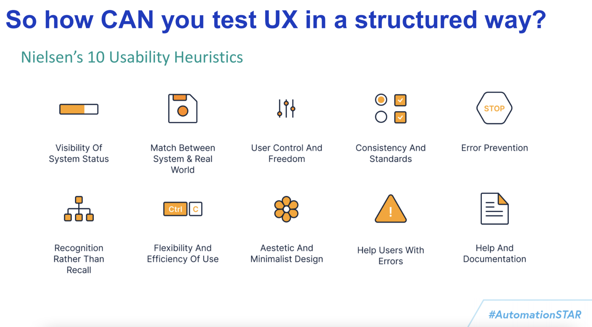
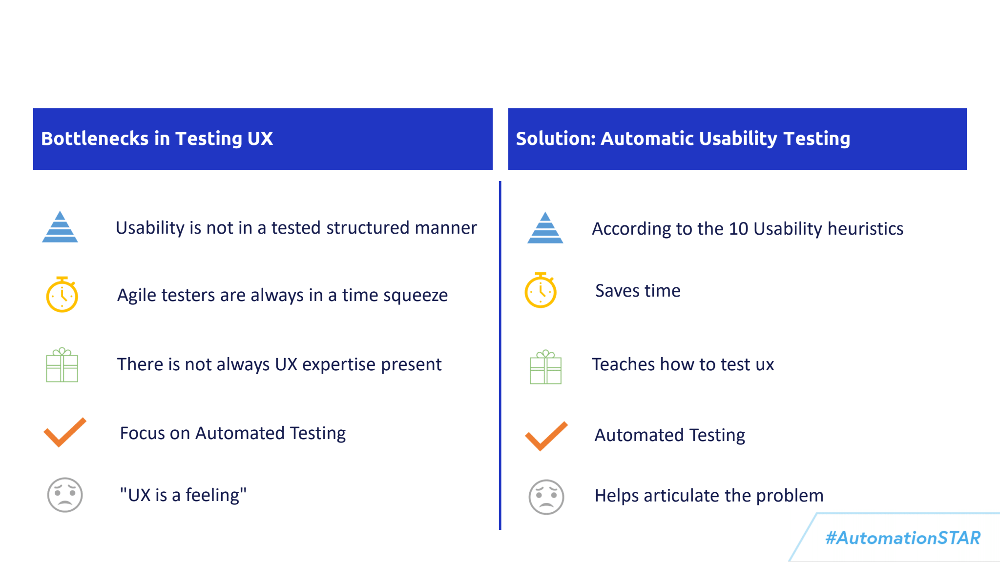
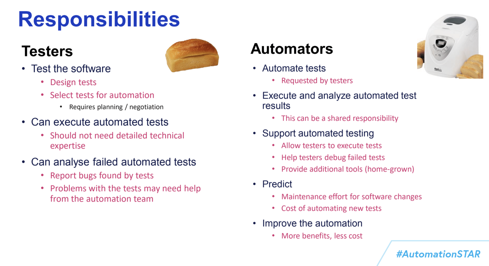
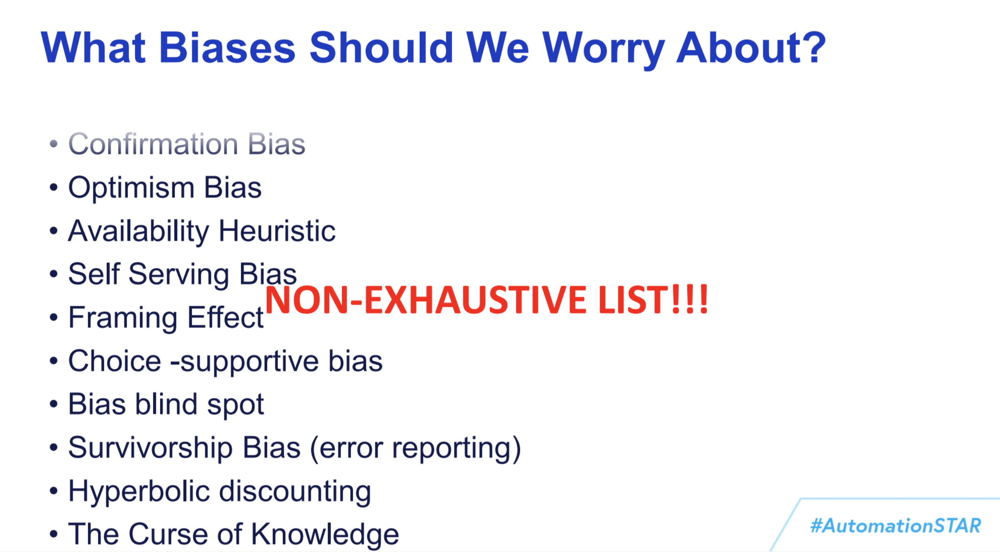
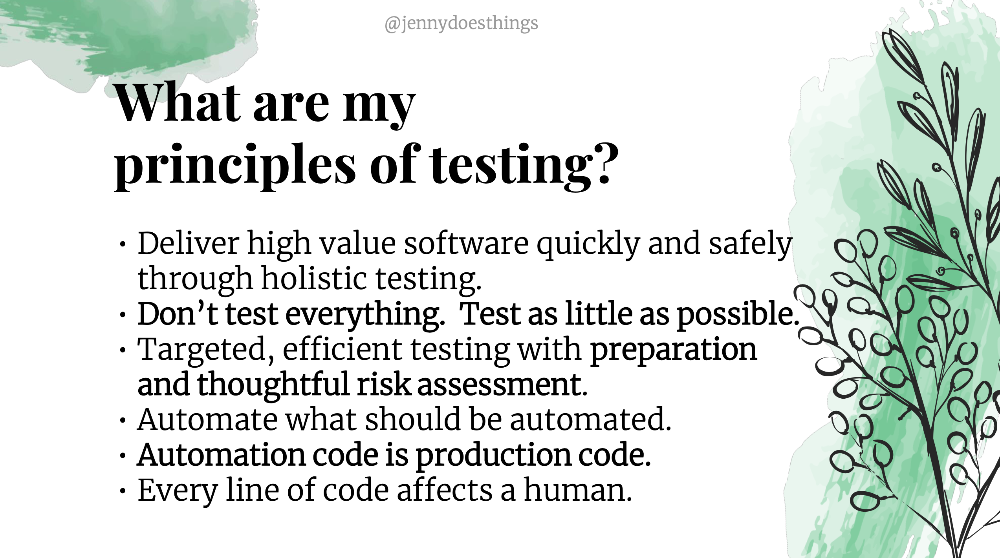
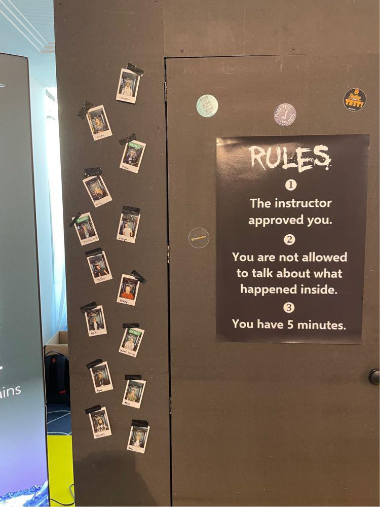

= AutomationSTAR 2022 Conference
TehreemFatima07
v1.0, 2022-12-06
:title: AutomationSTAR 2022 Conference
:imagesdir: ../media/2022-12-06-automation-star-conference
:lang: en
:tags: [conference, automation testing]

October 17 and 18 were the days for the Europe’s largest testing conference, https://automation.eurostarsoftwaretesting.com/[Automation STAR 2022]. About 100 passionate software testers gathered together in https://www.hilton.com/en/hotels/muchitw-hilton-munich-park/[Hilton Munich Park], for making automation testing experiences better.
++++
 
++++
Conference was focused mainly on test automation which covered a variety of different topics such as event driven test automation, cypress, test automation frameworks, strategy, functional testing, codeless test automation and soft skills of automation.

== Things before the Conference

One week before the conference an email was sent to all the attendees which has the instructions about the conference. The email also contained the link for the https://whova.com/portal/autom1_202210/?source=download_page/[whova app] where attendees can get live updates and chat with others. After registering on the app, all the information about the sessions and the speakers were available. Attendees can also initiate the discussion and can contact others like the ice breaking sessions. One interesting thing about the app was the Photo competition, where participants can post the conference pictures and picture with the maximum likes will receive the price.

== Conference Program

The https://automation.eurostarsoftwaretesting.com/conference/2022/programme/[conference program] included two days of Tutorials, keynotes, and talks led by experts from around the testing world. It also included exclusive networking and social events like lean coffee and Community Conversations. Prior to the conference, attendees have the option to choose the Tutorials and the sessions in the Whova App and from the app they can also download the slides for the presentations. The tutorials and talks were in German and English so attendees can select according to their preferred language. The tutorials were scheduled for half day and the talks were for forty-five minutes.

== Begins the Conference

The first day of the conference started with the Badge and goodies collection and morning coffee. Then attendees were directed to their selected tutorials which were scheduled for half day. Second half of the first day and the second day of the conference was the combination of Keynotes and talks. All attendees get to choose between different talks happening at the same time in separate conference rooms. At a time participants can attend one out of five talks.

== Talks at Conference:

In the following, I would like to briefly discuss the talks that we have attended:

== 1. Making Great Waves: 8 Software Testing Convictions

Testing is an art as much as Engineering, we can take cues from prolific artists in how we approach quality in our own work. In this keynote *Andrew Knight* mentioned how we can create our own great waves in software testing. He covered following eight auspicious ideas which were inspired by ukiyo-e printing:

- Focus on behavior
- Prioritize on risk
- Automate
- Shift left and right
- Give fast feedback
- Go lean
- Open up
- Show empathy

== 2. WebDriver BiDi – The Future of Cross-Browser Automation

Pain of browser automation was explained in a very coolest way by *Jecelyn Yeen*. She started with the history of web and automation, followed by how browser automation works behind the scenes and then explained the pros and cons of different ways of browser automation. In the end she listed her experiences with the WebDriver BiDi project and its current progress.

== 3. Mission Impossible: Automatic Usability Testing

If usability testing is part of the project then there are more chances of developing successful product. *Kimberly Snoyl* has delivered the talk focusing on the importance of UX testing, because sometimes the products are not user-friendly and users get frustrated easily while using it. To make processes simpler and better for the users, Kimberly is exploring the idea to create a tool which can automate some of the following 10 Usability Heuristics:

Her idea for creating a UX Automation tool won the EuroSTAR 2022 RisingSTAR award, because it solved the major problems in UX Testing, which are also listed below:

== 4. Test Automation: How to Start and Succeed

An important subject of starting and succeeding the Test Automation process was explained by *Chris Loader* in a very effective way and this talk was one of the standouts for me at the conference. Because test automation requires much of the mental work and it feels quite overwhelming in the start.
++++
 
++++
First step of this process is to set the *good objectives* for the test automation which includes:

- Reduce test execution time
- Automate X% of tests
- Automate tests that make life easier for other team members

After setting the objectives, next step is to understand the difference between the responsibilities for the Automation Tasks. Chris explained this by differentiating between the Testers and Automator's which is reflected in the following image:

It would be difficult, almost impossible, for me to summarize the whole experience in just a few lines. Still I would outline few important takeaways:

- Start automating with the Pilot project having realistic expectations, because its the easiest way to gain confidence with the automation test suite setup
- Be selective in automating the tests because not everything can be automated
- In an Agile Environment support both manual and automated tests
- You are never finished with automation, review and refactor your code regularly for making product more mature. Change tools, hardware when needed and keep a strict eye on the automation “health”.

== 5. Automating Bias

QA Engineers often face the situation where one of the obvious bug is missed and that’s only because of the Cognitive Biases that influence the entire thought process. On the basis of this bias automation engineers also encode some of these biases into the automation test suite, which can lead to very bad outcomes for software. *Dermot Canniffe* explained these common biases that affect the process include:

We can resolve these biases by adopting three basic strategies which include:

- Communication
- Collaboration
- Reframe Failure

== 6. Your Principles of Testing

In the last keynote, *Jenny Bramble* shared her own personal principles of testing. Key takeaway from this session is that having a roadmap and set of principles for ourselves will make us more proactive. Testing principles help us in taking the decisions, be it from choosing what falls into regression, to what gets automated, and even who to send invite to join the team.
++++
 
++++
Jenny also explained the Automation Testing principles, summary of which is explained in the picture:

++++
 
++++
Apart from the Keynotes and sessions, this conference has the *EXPO area* for the software test automation community. Companies like https://automation.eurostarsoftwaretesting.com/expo/applitools/[applitools], https://automation.eurostarsoftwaretesting.com/expo/testresults-io/[testresults-io] and https://automation.eurostarsoftwaretesting.com/expo/cqse/[CQSE] have their booths setup for explaining solutions, tools, and services to the participants.
++++
 
++++
One highlight of the event was the *_Black Box Challenge_* by https://www.testresults.io/[TestResults.io], every participant who took the challenge was given 5 minutes to enter the black box and solve the puzzle. Rule of this challenge is that no one was allowed to tell what’s inside the box. Fun part was that everyone came out of the box with a very wide smile.

The conference came to an end after two days of great learning and networking session. I truly enjoyed every single moment of the conference because it was my first Automation Star Conference and an amazing learning opportunity. The event was very well organised with everything being done on time and volunteers and organisers have put so much energy to make the event a great success.
++++
 
++++
I can’t wait to join another edition of the AutomationSTAR conference, next one will be in 2023 and you can https://automation.eurostarsoftwaretesting.com/newsletter-sign-up/[register your interests] for the next conference. Call for Speakers will open in January 2023, so stay tuned.

== Key Takeaways from the Conference for Lunatech

I would like to give a shout-out to Lunatech for providing their QA Team with this opportunity to experience AutomationSTAR conference in person. Lunatech's QA Team is working to integrate the quality into the fabric of software development throughout the lifecycle to enhance the testing processes and contents of this conference were proved to be fruitful for us. To check what QA Team is doing you can join the https://lunatechlabs.slack.com/archives/CS4HJR0VA/[global-guild-quality] channel on slack and keep yourself updated about the progress of quality culture in Lunatech.
++++
 
++++
I am so happy that finally after the corona times, physical conferences have returned and testing community can now get back to ensuring that quality software should be developed to help people in their everyday lives.
++++
 
++++
++++
 
++++
_All the screenshots of slides in blog post are taken from the content provided to the participants via email._
