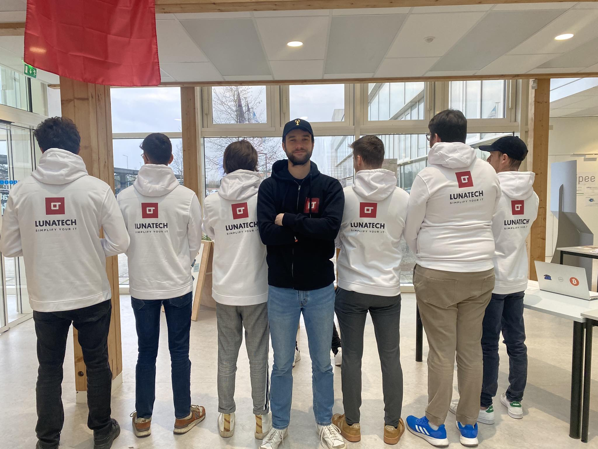
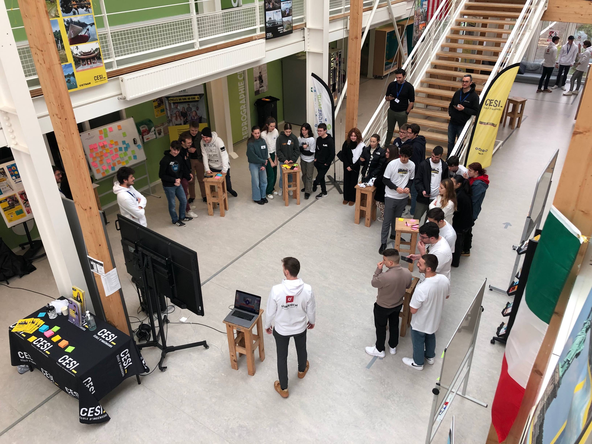
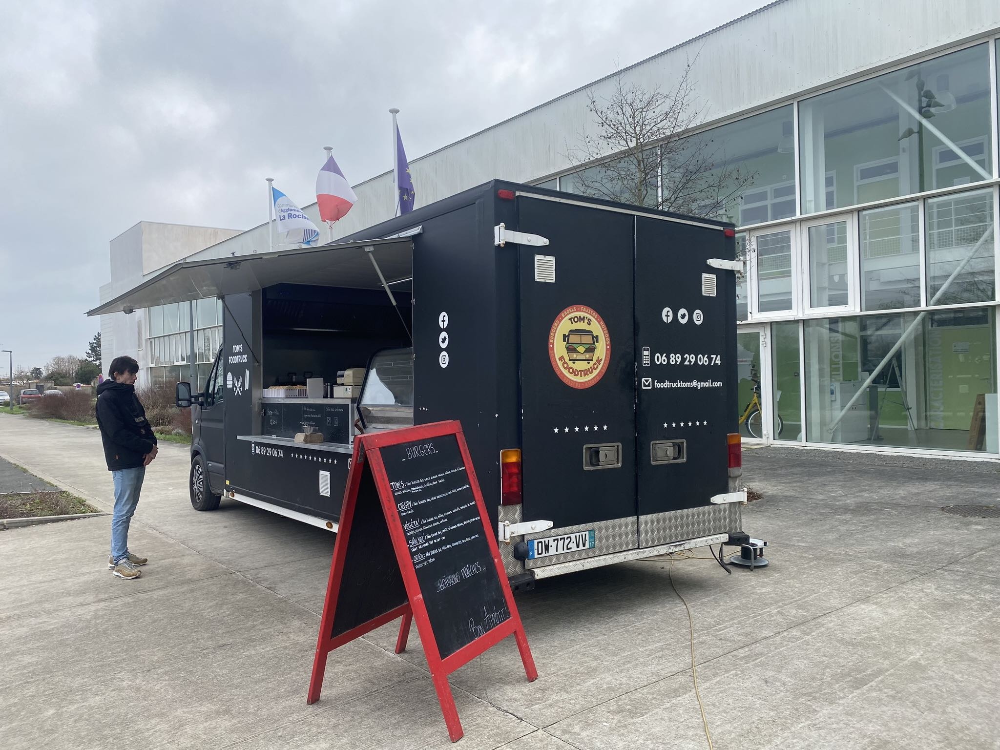
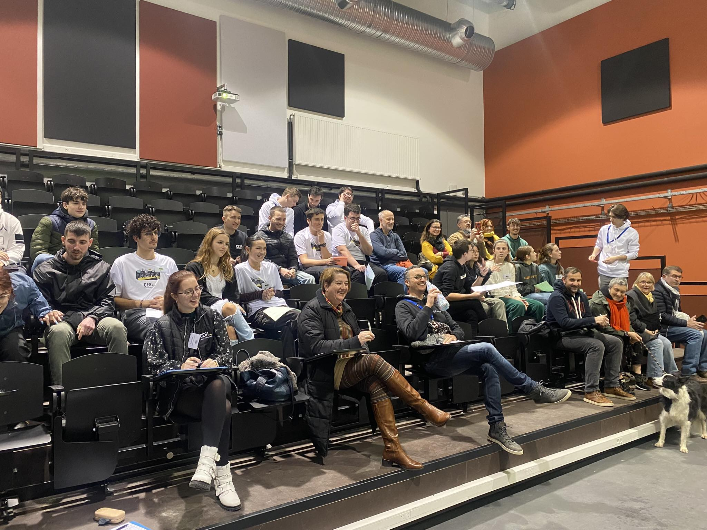
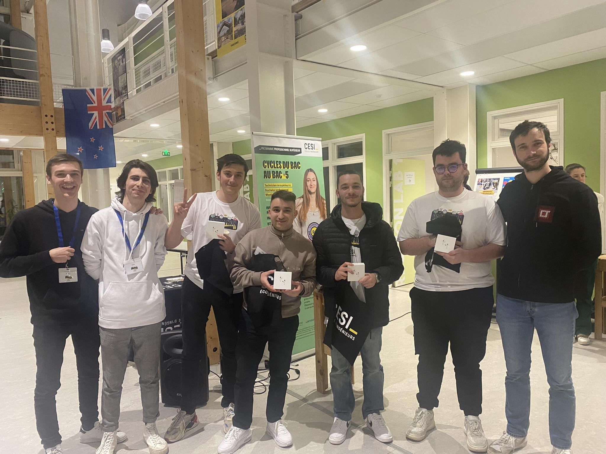
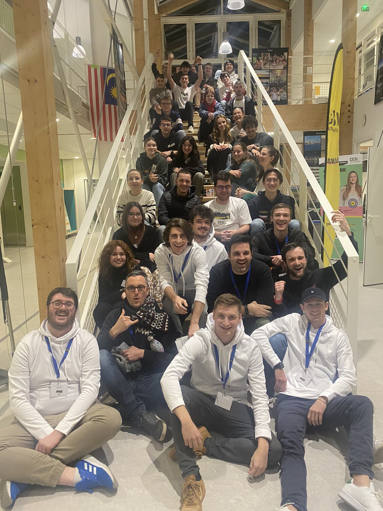

= Hackathon by Cesi
sachgar
v1.0, 2023-02-15
:title: hackathon-by-cesi
:lang: en
:tags: [hackathon, event, CESI, en]

On the 28th of January 2023, the [CESI engineering school](https://www.cesi.fr/) in La Rochelle hosted a hackathon with an apocalyptic theme. 25 participants gathered in teams of five to come up with innovative solutions to deal with an emergency situation. As with any event, it was essential for us to find sponsors to ensure that the event would be successful. We naturally thought Lunatech would be a good fit for us. They kindly agreed to finance the staff's hoodies and to send goodies for all of the participants.

The hackathon started with a presentation of the apocalyptic scenario: 

"Attention all participants of our hackathon! It is the 10th of January 2049! We have received alarming information that an apocalyptic catastrophe is about to happen in our city in the year 2050, according to the predictions of the doomsday clock and several scientists. Scientists estimate that it will happen in the next few months.
Fortunately, we have prepared a secure bunker to protect the participants of the event. However, it is our duty to prepare our city for this catastrophe. This is where you come in!
We need your help to find ways to protect the people and property of our city. You have 24 hours on 28 January to come up with an innovative and workable solution to this disaster.
We are counting on your ingenuity and determination to save our city. Good luck to you all!"

The presentation was followed by a brainstorming session to generate ideas. In order to help participants in their search for ideas, different techniques were used such as the https://en.wikipedia.org/wiki/World_caf%C3%A9_(conversation)[World Cafe]. 
This technique is great for brainstorming with an important number of groups, it goes as follows: each team has Post-it (a lot of them), a surface to stick them on and pens. During 5 minutes, each team put forth as many ideas as possible. The rule is quantity over quality. After 5 minutes, each team will go to the next team board, one member will stay to explain the idea to the other team. We can now repeat the first step for 5 minutes. The World Café allows each team to visit at least two different boards.

Participants had the chance to attend three exciting conferences on the topics of "Low Tech", "Women in Engineering" and the "Engineer of the Future" during the morning. The objective was to encourage participants to integrate or build on these topics in the research and development of their ideas. The conferences brought a new perspective to the participants on the current and future challenges of engineering. "Low Tech" was presented as a creative and sustainable alternative to high-tech technologies for dealing with emergency situations. The place of women in engineering was discussed, highlighting the importance of diversity in engineering in order not to deprive ourselves of any skills and to build an inclusive as well as equitable solution. The "Engineer of the Future" was presented as being more ethical, sustainable and aware of the consequences of their actions.

At around noon we stopped for lunch break and we were catered with a variety of seasonal burgers. They were tasty and of good quality and the fries were homemade. The ingredients used were local and produced in an environmentally friendly manner, supporting small producers and promoting sustainable food. Everyone enjoyed the lunch break, which allowed them to relax and recharge for the rest of the intense day of thinking and working. It reinforced their motivation to continue working on their ideas and innovative projects.

Lunch break was a key moment of the hackathon, as participants were able to discuss and exchange ideas with their teammates. This strengthened their cohesion and collaboration, which contributed to the success of their projects.

The teams then went back to work on developing their ideas and transform them into a real innovative concepts. The afternoon was also dedicated to the preparation of the final presentation during which the different teams had to face a jury in charge of establishing the ranking and an audience composed of all the coaches and parents.

After a few minutes/half hour the jury announced the results of the hackathon. The first place team conceptualized a survival school to teach people the skills needed to cope with an apocalyptic situation. The second place team developed the idea of a virtual reality simulation to help people prepare mentally and physically for the apocalypse. And finally the team completing the podium made a self-sufficient dome system, which can provide food, water and energy for people in an emergency situation.
The day ended with a prize-giving ceremony. The first team was awarded airpods, the second team received wireless speakers, the third team was given gift cards while the fourth and fifth team received chocolate sets made by a local company.

The apocalyptic hackathon in La Rochelle was an exciting event for participants, who had the opportunity to develop their brainstorming skills and apply their creativity to challenging situations. The ideas presented how innovation and equity can help prepare communities to face emergency situations while preserving the environment and promoting social justice.

Thanks a lot to _Titouan Guiochet_ who wrote this article with me!

