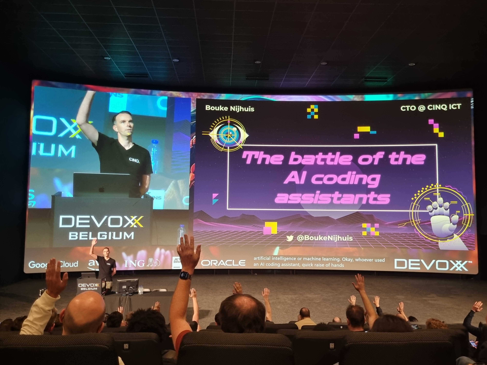
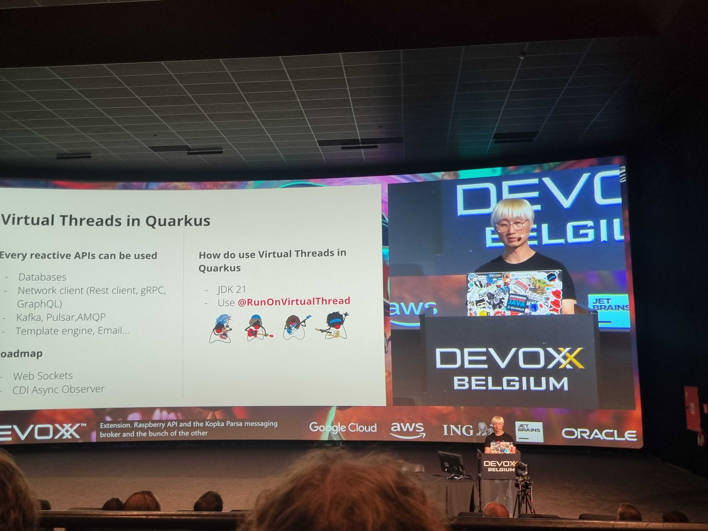
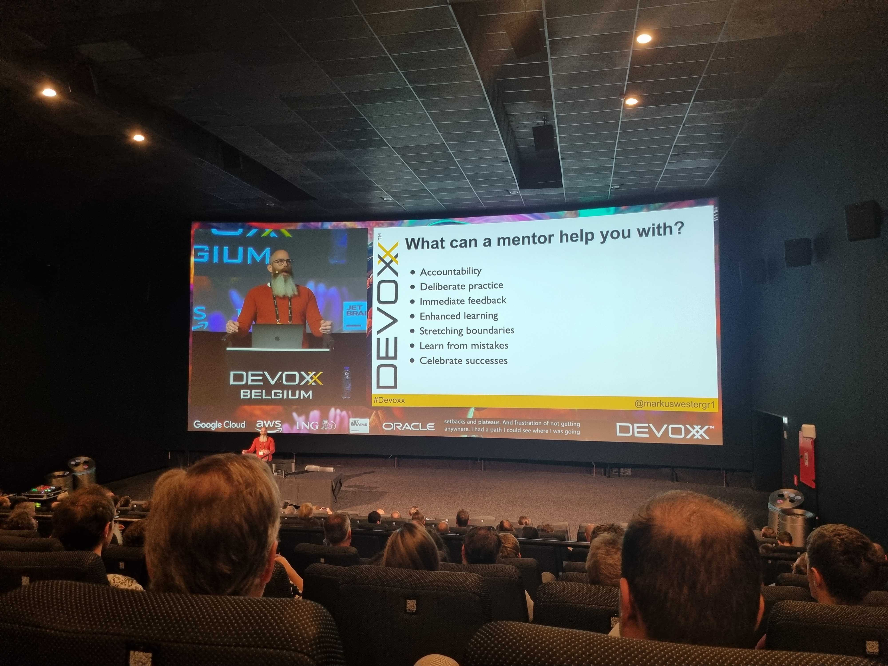

= Devoxx BE 2023
TODO author
v1.0, 2023-10-11
:title: Devoxx BE 2023
:imagedir: ../media/2023-10-11-devoxx-be-2023
:lang: en
:tags: [java, devoxx, en]

Recently a group of Lunatechies had the opportunity to attend the
https://devoxx.be[Devoxx BE conference]. Here's what they had to say about the
conference.

== Thoughts from Yabi

Last week, I had the exhilarating opportunity to attend Devoxx Belgium, where a
cascade of talks on Artificial Intelligence unfolded, each offering valuable
insights. One presentation, in particular, caught my attention and has left me
thoroughly impressed: the demonstration on utilizing Copilot and IntelliJ AI
assistance for coding. This AI assistant not only clarified code with admirable
ease, serving as an indispensable ally for comprehending legacy code bases but
also suggested thoughtful improvements to enhance the code's overall quality.
The chat feature embedded within the IDE made interacting with the AI assistant
remarkably straightforward, allowing for an intuitive and engaging user
experience. In a live demonstration, the assistant skillfully crafted unit
tests, illuminating its potential as a vital tool for both understanding and
augmenting existing code. I was particularly thrilled to envision using this
advanced technology as a virtual peer programmer, from which I could receive
immediate feedback and insightful suggestions for API usage, thereby
streamlining and enriching the coding process. With its ability to elucidate
and improve code, as well as facilitate the addition of unit tests, I can
clearly see this AI assistant becoming an indispensable asset in my daily
coding ventures.

== Thoughts from Nika

The Devoxx Belgium 2023 was an absolutely fantastic experience! There were many
interesting talks across every timeslot, making it a challenge to pick just one
to attend. Significant attention was given to the recently released Java 21,
and rightfully so. Watching Java evolve so fastly is really exciting. The new
features were released after preview, such as Sequenced Collections and Record
Patterns, and of course Virtual Threads. One of the most interesting talks for
me was called, "Closing the Developer Experience Gap of your Container Platforms."
Timo Salm delivered a great talk and provided many insights. So, it's really
crucial to understand that the developers' primary focus should be on
implementing business logic rather than spending time on configuring
infrastructure. Although Kubernetes and Docker are valuable tools, they offer
low-level abstractions, which is why having the right expertise is crucial for
proper use. To simplify developers' lives, there are platforms designed to
address these needs. These platforms take over after the development phase,
offering additional features and ensuring security. Timo provided an excellent
overview of existing platforms that might be used by everyone. We are already
in discussions about which ones could be suitable for our project! I also
really enjoyed the talk "Kubernetes: From 0 to Production-Grade with Java" by
Kevin Dubois and Alex Soto. The talk and demo was really fun! During the demo,
the Quarkus app was being prepared to be delivered to the Kubernetes cluster.
And it turned out to be surprisingly simple and straightforward, thanks to
Quarkus! During the break I also didn't miss the opportunity to get the signed book by Alex Soto, _GitOps Cookbook: Kubernetes Automation in Practice_. I'm
eagerly looking forward to reading it and sharing it with my fellow Lunatechies!

== Thoughts from Jeremy

Hey, I'm Jeremy, a junior software engineer at Lunatech, and it was my first
time attending a Devoxx conference! It was a really great experience. There
were many good technical talks, but the one I remember the most is about
mentoring. Both Sébastien (my mentor) and I attended the session titled
"Empowering Growth: The Art of Harnessing Your Mentor's Expertise as a Senior
Developer." Clearly, I'm not a senior software engineer, but this talk was
about how you can use a mentor to progress in your career. With Sébastien being
my mentor, I learned a lot about being a good mentee! Because this was feedback
from a senior engineer, Sébastien was more interested in the part about how you
can use mentoring, even as a senior, to continue progressing in your career.
So, this talk was interesting for both of us!