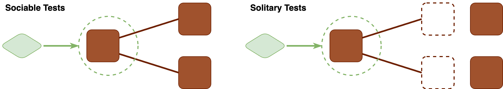
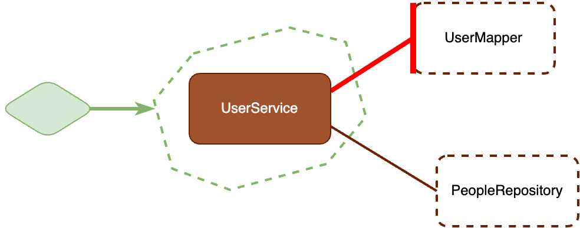
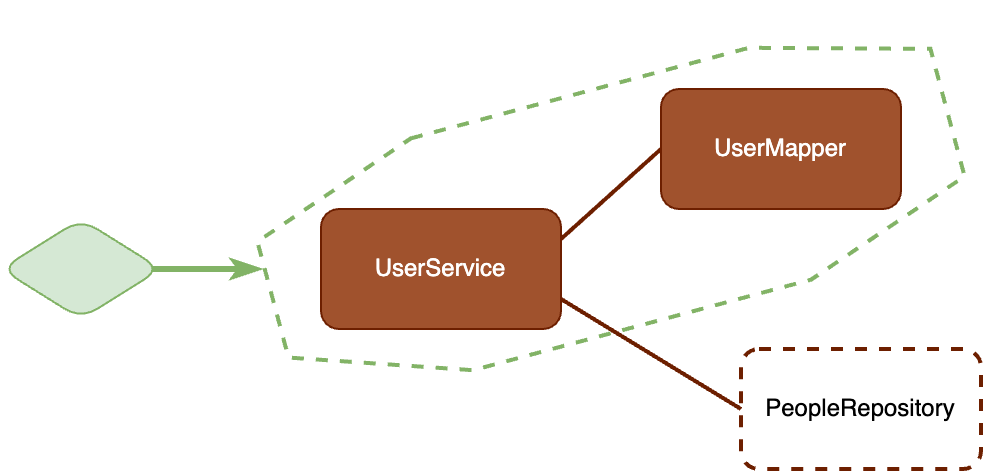

= The Unit of a test
eamelink
v1.0, 2024-11-15
:title: The Unit of a test
:lang: en
:tags: [java, testing, quality]

Have you ever heard someone about writing a test for a class or for a method? I bet you have. Yet this may be an indication of something being wrong. In this post, we'll discuss a common misconception about unit testing, what the impact of that misconception can be, and what to do instead.

The misconception is that the term _unit_ in unit testing refers to a _structural unit_, such as a class or a method. But this should not be the intention. Instead, the intention should be to test a _unit of behaviour_. 

Let's look at an almost trivial example. Suppose we have a UserService that can retrieve users from a repository, but which has to map between two different domains. It would use following two classes:

[source, java]
----
public class UserService {

	private final PeopleRepository peopleRepository;

	public UserService(PeopleRepository peopleRepository) {
		this.peopleRepository = peopleRepository;
	}

	public getUserById(String id) {
		Person person = peopleRepository.getPersonById();
		return UserMapper.fromPerson(person);
	}

}

class UserMapper {
	static User fromPerson(Person person) {
		... map from person to user ...
	}
}
----

Now, a common mistake is that a proper unit test of the `UserService` requires to test it _in isolation from other classes_. In this case, that would mean to test the `UserService` without the real `UserMapper`, but instead with a test double for the `UserMapper`. 

In this code, that's hard, because there's no way to make UserService use a test double. This may get people to modify the code to make replacement of the `UserMapper` possible:

[source, java]
----
public class UserService {

	private final PeopleRepository peopleRepository;
	private final UserMapper userMapper;

	public UserService(PeopleRepository peopleRepository, UserMapper userMapper) {
		this.peopleRepository = peopleRepository;
		this.userMapper = userMapper;
	}

	public getUserById(String id) {
		Person person = peopleRepository.getPersonById();
		return userMapper.fromPerson(person);
	}

}

public class UserMapper {
	User fromPerson(Person person) {
		... map from person to user ...
	}
}
----

We've changed the static invocation of `fromPerson` to a method call on an instance of `UserMapper`, which we added as a field and to the constructor of `PeopleService`.

Some people would exclaim: "See, this is why static methods are bad! They make testing hard!". Now, a test can be written:

[source, java]
----
class UserServiceTest {

	@Mock
	UserMapper userMapper;

	@Mock
	PeopleRepository peopleRepository;

	@Test
	testGetById() {
		UserService userService = new UserService(peopleRepository, userMapper);
		Person testPerson = new Person();
		when(peopleRepository.getPerson("123")).thenReturn(testPerson);
		User testUser = new User();
		when(userMapper.fromPerson(testPerson)).thenReturn(testUser);

		User user = userService.getUserById("123");

		assertEquals(testUser, user);
	}

}
----

Now we managed to test this class 'in isolation', and some would say all is well. But all is not well, this is not a good unit test.

This test is now tied to specific implementation details, which makes it hard to maintain, and prone to requiring changes when the implementation (but not behaviour!) of the `UserService` changes. The whole existence of the `UserMapper` is an implementation detail, as is the method `fromPerson`. We should be able to refactor this whole class away, and for example create a private `mapPersonToUser` method right within the `UserService`. Such a refactoring should not require a change of the test.

(https://martinfowler.com/bliki/UnitTest.html)[Martin Fowler drew diagrams] similar to the ones below, that illustrate (https://leanpub.com/wewut)[Jay Fields]' concepts of Solitary and Sociable Unit tests:

In our example, we could draw it with the following classes 

Note that we took the solitary unit test approach here. The disadvantage is that now we've tied the test to the interface between the `UserService` class and it's collaborator `UserMapper`.

If we would have made a sociable unit test instead, that would not have happened. We could have used the original code with the static method invocation of `UserMapper.fromPerson`, and our test would look like this:

[source,java]
----
class UserServiceTest {

	@Mock
	PeopleRepository peopleRepository;

	@Test
	testGetById() {
		UserService userService = new UserService(peopleRepository);
		when(peopleRepository.getPerson("123")).thenReturn(testPerson);
		User user = userService.getUserById("123");
		assertEquals("123", user.id);
	}

}
----

Our test is now simpler and no longer tied to the interface of `UserMapper`. As a diagram, it would now look like the following:

Here, we drew the dashed green line around both the `UserService` and the `UserMapper`, which together provide the _unit of behaviour_ we're trying to test.

Some final considerations. Maybe you _also_ want to have tests for `UserMapper`, because it may have complex behaviour. That's fine. There's nothing wrong with the tests for the `UserService` using the real `UserMapper`, and there also being additional tests that provide better coverage of `UserMapper`.

In our code, we did use mocks for `UserRepository`, because we considered that a different unit of behaviour. Or maybe because it's slow to test or modifies shared state. Unfortunately there are no hard rules for what exactly is a unit of behaviour, certainly not one that's as easy as the structural unit counterpart of 'one class' or 'one method'. Picking a suitable unit of behaviour requires some taste. One thing you could take into consideration is whether a class really exposes a public interface (not in the technical sense of `public` or `interface`, but in the conceptual sense), that includes a clear contract and is relatively stable. If it does, replacing it with a test double may make sense. But classes that merely exist as an implementation detail are best tested in a sociable way.