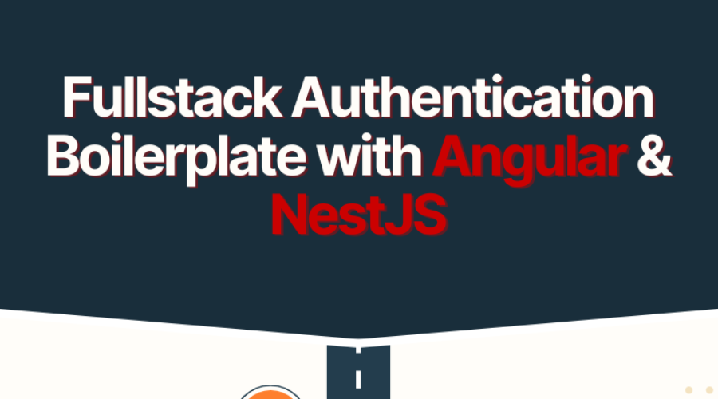

= Full-Stack Authentication Boilerplate: Angular + NestJS + PostgreSQL
jakeortega
v1.0, 2025-04-04
:title: Full-Stack Authentication Boilerplate: Angular + NestJS + PostgreSQL
:lang: en
:tags: [angular, nestjs, postgresql, typeorm, jwt, authentication, frontend, typescript, nodejs]

*A practical series for backend developers building secure full-stack apps*

This series is for backend developers who want to ship real-world full-stack projects—without getting lost in frontend complexity.

We’re building a **full-stack authentication boilerplate**—a reusable, modular codebase that gives you login, registration, route protection, token handling, and database integration out of the box. You can clone it, customize it, and start building your own apps faster.

'''''

== 🧱 Why This Stack?

We chose **Angular 19** and **NestJS** for a reason:

- **TypeScript end-to-end**: Write frontend and backend code in the same language with consistent tooling.
- **Angular 19** brings powerful new features like Signals and control flow syntax (`@if`, `@for`) that simplify frontend state and UI logic.
- **NestJS** is a structured, opinionated backend framework that feels familiar to Spring or .NET devs. It’s built for testability, modularity, and clean code.
- **PostgreSQL** + **TypeORM** give us a robust, relational data layer with strong typing and migrations.

Could you build this with React, Express, or MongoDB? Absolutely. But this series is focused on a **structured, full-featured stack** that balances developer experience with scalability—great for teams or solo projects alike.

'''''

== 🗺️ What’s in the Series?

Here’s the roadmap 👇

Each post builds on the last, guiding you through:

- ✅ JWT login & registration
- ✅ Angular route guards & auth state
- ✅ NestJS modules, guards, and services
- ✅ PostgreSQL setup with TypeORM
- ✅ CI/CD, E2E tests with Playwright, and Docker deployment

No prior Angular or NestJS experience is required—just TypeScript and backend fundamentals.

'''''

== 🧭 Why This Series Exists

You don’t need another to-do app.

You need a **working authentication foundation** you can reuse, extend, and deploy. This series gives you just that—while teaching core frontend + backend skills along the way.