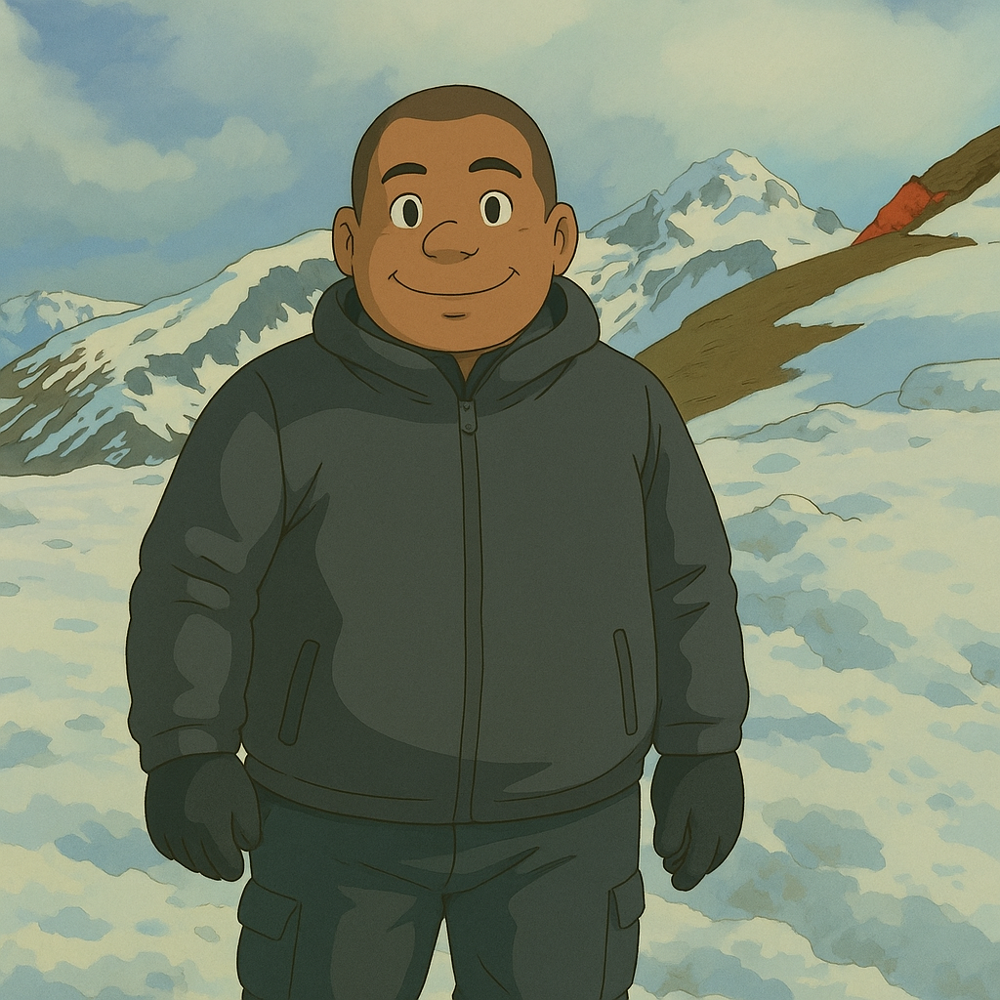

= Have You Tried Turning Your Photo Into These 8 Art Styles Using ChatGPT?
jakeortega
v1.0, 2025-04-17
:title: Have You Tried Turning Your Photo Into These 8 Art Styles Using ChatGPT?
:lang: en
:tags: [ChatGPT, DaLL·E, AI, Art Styles]

== Have You Tried Turning Your Photo Into These 8 Art Styles Using ChatGPT?

If you're still using ChatGPT just for debugging or boilerplate, you're missing the fun stuff. The image tools? Totally underrated.

With ChatGPT Plus and DALL·E, you can generate completely different art styles from a single photo—LEGO, anime, Pixar, pixel art, you name it. Just upload a photo and type a prompt. That’s it.

[NOTE]
====
DALL·E doesn’t apply a filter—it reimagines your image. When you upload a photo and prompt a style, ChatGPT passes that information to DALL·E, which generates a brand-new image based on the original's composition, pose, and vibe.
====

Here’s a quick rundown of 8 styles worth trying—whether you’re just killing time between builds or exploring what else AI can do beyond code.

---

=== 1. *LEGO Style*  
You, but made of bricks. Blocky face, glossy plastic, and that classic minifig expression.  
*Prompt:* `"Change this photo to LEGO style"`

---

=== 2. *Pixel Art Style*  
Think NES/SNES-era retro. Minimal detail, max nostalgia.  
*Prompt:* `"Make this photo pixel art style"`

---

=== 3. *Minecraft Style*  
3D pixel blocks, low-res textures—just enough detail to recognize yourself.  
*Prompt:* `"Change this photo to Minecraft art style"`

---

=== 4. *Anime Style*  
Crisp lines, smooth gradients, sharp eyes—main character energy.  
*Prompt:* `"Change this photo to anime style"`

---

=== 5. *Knitted Toy Style*  
Crocheted version of you. Soft, quirky, and a little uncanny.  
*Prompt:* `"Change this photo to knitted toy style"`

---

=== 6. *Looney Tunes Cartoon Style*  
Big eyes, bouncy lines, exaggerated features.  
*Prompt:* `"Change this photo to Looney Tunes cartoon style"`

---

=== 7. *Pixar Style*  
High-end CG, expressive eyes, and that wholesome, soft-light look.  
*Prompt:* `"Change this photo to Pixar art style"`

---

=== 8. *Studio Ghibli Style*  
Warm color palette, calm expressions, thoughtful lines.  
*Prompt:* `"Change this photo to Studio Ghibli style"`

---

== How to Use These (Quick Version)

. Open ChatGPT (Plus).
. Upload a photo.
. Use any of the prompts above.
. Let DALL·E generate your new avatar.

---

Not everything has to be code. This takes two minutes and makes for a solid profile pic, a fun break, or even your next Slack avatar. And if you're feeling spicy, you can automate the whole thing with the API.

You’ve got the tools. The only question is—what version of you are you making today?
