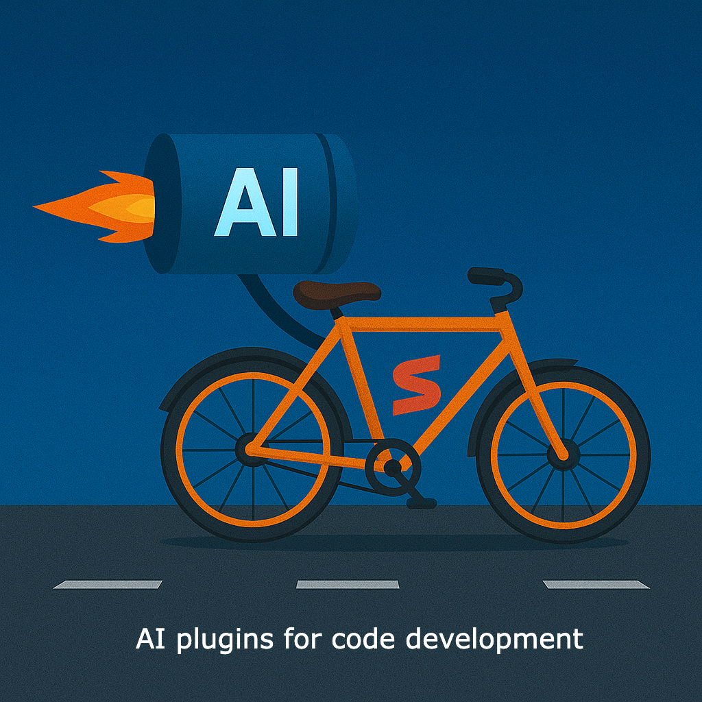

= AI plugins for code development
maniyalraj
v1.0, 2025-05-02
:title: AI plugins for code development
:lang: en
:tags: [AI, IntelliJ AI Plugins,Local LLMs, en]

== Introduction
Recently, I experimented with integrating AI into my IntelliJ IDEA setup for JVM development, and I wanted to share the steps I followed. It turned out to be really helpful, so maybe this guide can assist someone else in getting started too!

IntelliJ is one of the preferred IDE for Java, Scala and Kotlin development. I have been using the IntelliJ IDEA with plugins for AI, which allows me to use Local LLMs to generate code suggestions, refactor my code and even write tests for me.

== What I did

**Step 1: Install Ollama**

First, visit link:https://ollama.com/[Ollama] and download the version for your operating system. Follow the simple installation steps.

Open your terminal and run `ollama pull llama3` to download the model. Start the model by running `ollama serve llama3`.

TIP: Choosing the right model is very important .

**Step 2: IntelliJ Plugins**

I tested a few plugins and found Continue.dev really useful:

NOTE: A list of plugins at the bottom of this article with links

Continue.dev
Helps with code completion, converting comments into code, and debugging tips.
Works locally (privacy-friendly), quick.
Needs decent hardware resources.

**Step 3: Setting Up Continue.dev with IntelliJ**

Install the Plugin:
Open IntelliJ IDEA, navigate to Settings -> Plugins, search for "Continue.dev", and install it.

Connect to Ollama:
Open the Continue.dev settings and add the local Ollama server URL (`http://localhost:11434`).

**Step 4: Exploring AI Features**

Code Suggestions:
The plugin provided accurate code completions immediately, significantly speeding up my workflow.

Generating Code from Comments:
I tried writing simple English comments, and Continue.dev translated them into functioning code snippets effortlessly.

Debugging:
Even when intentionally making small errors, the plugin quickly suggested effective fixes.

**Step 5: AI-Assisted Refactoring**

I highlighted some messy code.
Using the AI suggestions via right-click helped clean up and optimize the code efficiently.

== Tips for Best Results:

Regularly update plugins and AI models for optimal performance.

If hardware resources are limited, experiment with smaller models initially.

== IntelliJ IDEA Plugins Supporting Local LLM Integration

[cols="1,2,2,2", options="header"]
|===
| Plugin
| Features
| Pros
| Cons

| *link:https://plugins.jetbrains.com/plugin/22707-continue[Continue.dev]*
a|- Code completion
- Natural language to code generation
- Inline code explanations
- Supports multiple local LLM providers
| - Open-source
- Highly customizable
- Supports various local LLMs like Ollama, LM Studio, GPT4All
| - May require manual configuration for optimal performance

| *link:https://plugins.jetbrains.com/plugin/24169-devoxxgenie[DevoxxGenie]*
a| - Code review and explanation
- Unit test generation
- Retrieval-Augmented Generation (RAG)
- Integration with various local LLMs
| - Fully Java-based
- Rich feature set including RAG and Git Diff viewer
- Supports multiple local LLMs
| - Interface may be overwhelming for beginners

| *link:https://plugins.jetbrains.com/plugin/21056-proxy-ai[Proxy AI]*
a| - Connects IntelliJ IDEA with locally running LLMs
- Provides AI assistance features
| - Open-source
- Simple setup for local LLM integration
| - Limited feature set compared to other plugins

| *link:https://plugins.jetbrains.com/plugin/24372-codegpt-chat--ai-agents[CodeGPT]*
a| - AI-powered code suggestions
- Chat interface within IntelliJ IDEA
- Supports local LLMs via LM Studio
| - User-friendly interface
- Supports multiple programming languages
| - May require additional setup for local LLM integration

| *link:https://plugins.jetbrains.com/plugin/22282-jetbrains-ai-assistant[JetBrains AI Assistant]*
a| - AI-driven code suggestions
- Code explanations and documentation generation
- Integration with local LLMs
| - Official JetBrains plugin
- Seamless integration with IntelliJ IDEA
| - May have limited customization compared to open-source alternatives
|===

