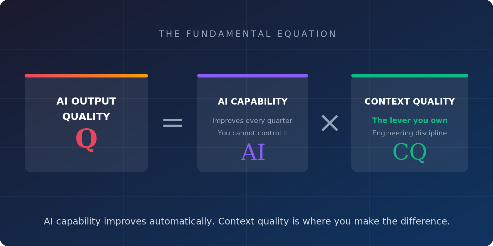

= Software Will Cost Almost Nothing. What Happens Next?
nicolasleroux
v1.0, 2026-04-28
:title: Software Will Cost Almost Nothing. What Happens Next?
:lang: en
:tags: [AI, software engineering, legacy modernization, agentic coding, en]

Every industrial revolution until now replaced muscle. The steam engine, the assembly line, the tractor -- each one amplified physical labor and made goods cheaper to produce. But the revolution we are living through right now is fundamentally different. For the first time, what is being replaced is the ability to produce structured intellectual output: code, documentation, test plans, architecture decisions, migration scripts, compliance reports. All of these can now be produced by AI agents.

The implications for our industry are staggering. If software -- the most valuable and most expensive asset of the modern enterprise -- can be produced at a fraction of today's cost, then what changes?

Everything.

== The cost of inaction is no longer abstract

At RivieraDev 2025, my co-speaker Quentin Adam and I delivered a keynote titled "The Cost of Inaction." The thesis was simple: standing still is the most expensive decision a company can make.

The evidence was everywhere. Kodak invented the digital camera in 1975 and filed for bankruptcy in 2012. Blockbuster declined a partnership with Netflix in 2000 and closed 9,000 stores. BlackBerry dismissed the iPhone in 2007 and holds zero market share today. None of these companies lacked talent or technology. They lacked the courage to act.

Meanwhile, in 2026, 240 billion lines of COBOL remain in production. 43% of banking and insurance systems still run on mainframes. The average cost to modernize? $9.1 million -- until now.

The hidden costs of inaction are technical (accumulated tech debt, lost innovation capacity), organizational (flat structures that lack ownership), and personal (stalled careers, missed opportunities). Inaction does not protect you. It just delays the consequences.

== But what if the cost of action collapses?

This is where the story takes a dramatic turn. AI-assisted software development has moved from autocomplete in 2020 to fully agentic coding in 2026. The numbers are unambiguous: 46% of code written by Copilot users is AI-generated, productivity gains of 26% across thousands of developers, and 55% faster task completion in controlled experiments. And these benchmarks are already months old -- every quarter brings another generation leap.

Consider what this means in practical terms. A COBOL migration that cost $9.1 million and took 18 months in 2020 can now be completed for $2-4 million in 6-8 months. A custom CRM that required $500K and a year of development can be built for $80K in three months. A full test suite for a legacy application that would have cost $200K and six months of manual work can be generated for $15K in two weeks.

Same scope. Same quality. Fraction of the cost.

When action costs almost nothing, inaction becomes inexcusable.

== Engineers become orchestrators

But there is a catch. AI does not mean pressing a button and watching the magic happen. Without structure, AI produces plausible but generic output that needs extensive rework. The difference between success and failure lies entirely in methodology.

The new role of the software engineer is not to type code. It is to orchestrate AI agents -- curating context, defining quality gates, structuring work, verifying output, and accumulating knowledge over time. Like a conductor in front of an orchestra, the engineer sets the tempo, the dynamics, and the interpretation. The performance depends entirely on the score.

This is captured in a simple equation:

[.lead]
*AI Output Quality = AI Capability x Context Quality*

AI capability improves every quarter. You cannot control it. Context quality is the lever you own. This is where engineering discipline makes the difference between a demo and production-grade software.

== A battle-tested methodology

At Lunatech, we have spent the past two years building a methodology that makes AI-accelerated modernization reliable, reproducible, and predictable. Our Legacy Modernization with AI framework is built on seven phases -- Discover, Reverse-Engineer, Re-Architect, Rebuild, Migrate, Harden, Handover -- each with clear deliverables and exit gates.

At the heart of the framework is the Claude Context Pack: a versioned, curated knowledge base with seven layers (System, Code, Data, Business, Architecture, Test, Decision) that feeds every AI task with precisely the right context. A dedicated AI engineer builds, curates, and maintains it throughout the engagement.

The result? Small teams of 2-4 senior engineers plus a dedicated AI engineer consistently outperform larger traditional teams. Parity is verified through behavioral equivalence testing and parallel running -- not assumed. And the context pack is transferred to the client as a durable asset at handover: the living documentation the legacy system never had.

== What this means for you

If you are a CTO sitting on a legacy system and thinking "we'll modernize next year," know that next year never comes. And the bill keeps growing. If you are a software engineer still building the same kind of applications with the same kind of tools, your skill set is becoming stale. The competitive advantage is shifting from code production to speed and judgment.

The cost of software is collapsing. The skill is no longer writing code -- it is orchestrating agents. And methodology is what separates production-grade output from demos.

Take the first step. Start something.

'''

_This is the first in a series of five articles based on my talk "Software Will Cost Almost Nothing. What Happens Next?" For more details on each theme, follow the series on our blog and on LinkedIn._

_Contact: nicolas.leroux@lunatech.com | https://lunatech.com[lunatech.com]_
