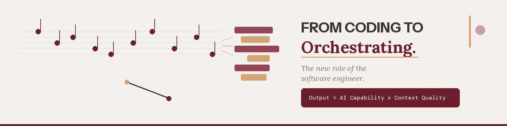

= From Coding to Orchestrating: The New Role of the Software Engineer
nicolasleroux
v1.0, 2026-05-19
:title: From Coding to Orchestrating: The New Role of the Software Engineer
:lang: en
:tags: [software engineering, AI orchestration, context quality, spec-driven development, en]

There is a widespread fantasy about AI in software development. It goes like this: you tell the AI to rewrite your entire banking system in Kotlin, press a button, go to lunch, and come back to a perfect application.

That is not how it works. And understanding why is the most important career insight for any engineer today.

== It is not magic

Without structure, AI produces plausible but generic output that requires extensive rework. Ask it to "rewrite this COBOL module in Java" and you will get syntactically correct code with wrong field names, missing business rules, no error handling patterns, and a result that needs 80% rework. It looks impressive in a demo. It fails in production.

The difference between success and failure lies entirely in methodology. AI is extraordinarily powerful, but it is not autonomous in any meaningful sense. It does not know your domain, your constraints, your naming conventions, your business rules, or your definition of "done." It needs to be told. And the quality of what you tell it determines the quality of what you get back.

This is captured in a single equation that governs everything:

[.lead]
*AI Output Quality = AI Capability x Context Quality*

AI capability improves every quarter. You cannot control it. That is Anthropic's job, or OpenAI's, or Google's. Context quality is the lever you own. This is where engineering discipline makes the difference.

== Conductors, not instrumentalists

The metaphor that best captures the new role of the software engineer is the orchestra conductor. A conductor does not play every instrument. They set the tempo, the dynamics, and the interpretation. They ensure that dozens of musicians play together coherently, that the quiet passage builds properly into the crescendo, that the timing is precise.

Similarly, the modern software engineer does not write every line of code. They orchestrate AI agents -- setting the context, defining the constraints, breaking work into coherent tasks, verifying each output, and accumulating knowledge over time.

The new core skills are: preparing the right context, defining quality gates, structuring work for AI consumption, verifying output rigorously, and curating knowledge so it compounds over time.

== A tale of two prompts

The difference between naive and engineered AI use is dramatic.

The *naive prompt* says: "Rewrite this COBOL module in Java." What you get back is generic Java code with wrong field names, missing business rules, no error handling patterns, and a result that needs 80% rework.

The *engineered prompt* says: "Rewrite COBOL module X following target architecture Y, with these business rules, these naming conventions, these test cases, and these equivalence criteria." What you get back is code that is correct on the first pass, matches the target architecture, uses domain-specific naming, and passes equivalence tests. It needs 5-10% review.

The delta between these two outcomes is not the AI model. It is the context.

== What context means in practice

At Lunatech, we have formalized context into seven layers that together form what we call the Claude Context Pack:

*System*:: What the system does, who uses it, and why it exists.
*Code*:: Structure, modules, and dependencies.
*Data*:: Schemas, golden input/output samples, and data categories.
*Business*:: Domain glossary, business rules, and workflows.
*Architecture*:: Target stack, coding standards, and non-functional requirements.
*Test*:: Equivalence test patterns and behaviors to preserve.
*Decision*:: Architecture decision records (ADRs), constraints, and non-negotiables.

Each AI task receives a task-specific brief assembled from the relevant slices. Translating a module? The agent gets the legacy code, the business rules, the target architecture, the equivalence tests, and an example. Writing a migration script? It gets schemas, transformation rules, and golden datasets for verification.

Targeted context produces precise output. Generic context produces generic output.

== Spec-driven development

For regulated domains -- banking, insurance, health -- we take this a step further with spec-driven development. Between the reverse-engineering and rebuild phases, business rules and integration contracts are turned into executable specifications: behavior scenarios (Given/When/Then), contract tests for every API boundary, and property-based tests for edge cases.

These specs become the acceptance criteria that AI agents use as guardrails, auditors use to verify compliance, and CI pipelines use to catch regressions immediately. The specification becomes the single source of truth for what the system must do.

== Why this should excite engineers, not frighten them

A common reaction to these changes is anxiety: "If AI writes the code, what am I for?"

The answer is: everything that matters. Judgment, domain understanding, architecture decisions, verification, quality -- these are the hard parts of software engineering. They always have been. Writing the code was never the bottleneck; understanding what to write and why was.

Engineers who embrace orchestration -- who learn to prepare context, structure tasks for AI agents, and verify output rigorously -- will find themselves dramatically more productive. A single engineer with well-curated context and good methodology can now deliver what previously required a team of five.

But engineers who insist on typing every line themselves, who resist the shift from instrumentalist to conductor, will find themselves increasingly unable to match the output of their AI-augmented peers. Being a good engineer is not about knowing a particular technology. It is about understanding the business and learning fast.

The question is not whether this transformation is coming. It is already here. The question is whether you will lead it or be overtaken by it.

'''

_This is the fourth in a series of five articles based on the talk "Software Will Cost Almost Nothing. What Happens Next?" In the final article, we will reveal the complete methodology that makes AI-accelerated legacy modernization reliable and reproducible._

_Contact: nicolas.leroux@lunatech.com | https://lunatech.com[lunatech.com]_
