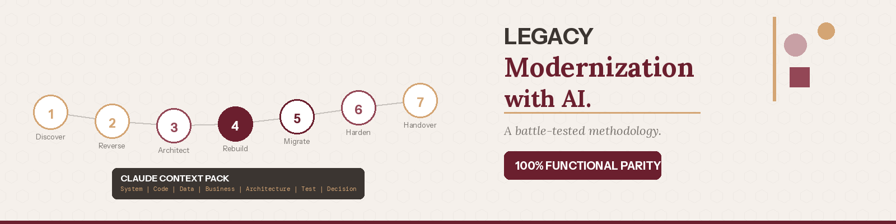
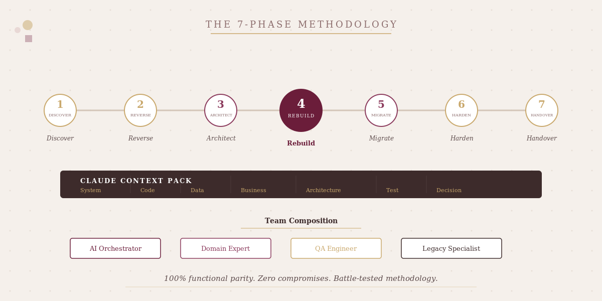

= Legacy Modernization with AI: A Battle-Tested Methodology
nicolasleroux
v1.0, 2026-05-26
:title: Legacy Modernization with AI: A Battle-Tested Methodology
:lang: en
:tags: [legacy modernization, AI methodology, agentic coding, context pack, en]

In the previous articles, we established three things: inaction is expensive, AI is collapsing the cost of building software, and engineers are becoming orchestrators rather than instrumentalists. The natural question is: how do you put all of this together into a real engagement, with real stakes, real data, and zero tolerance for regression?

This article reveals the methodology we have been building and refining at Lunatech over the past two years: Legacy Modernization with AI.

== The operating principle

Everything in our framework starts from a single, non-negotiable principle:

[quote]
For the same input, under the same preconditions, the new system produces exactly the same observable output as the legacy system.

100% functional parity. Verified, not assumed. This is not a best-effort goal -- it is the exit criterion. Every phase, every deliverable, and every quality gate is designed to serve this principle.

== Three commitments

We make three commitments on every engagement.

First, *100% functional parity*. We use behavioral equivalence testing and parallel running to prove that the new system matches the old one. Parity is verified through automated comparison, not through manual testing or optimistic assumptions.

Second, *a reproducible methodology*. The same seven-phase framework, the same deliverables, the same quality gates -- on every engagement, regardless of size. Consistency removes guesswork and makes outcomes predictable.

Third, *AI as a first-class tool*. We use agentic coding with Claude Code on every engagement, supported by a dedicated AI engineer who curates context for every task. AI is not an afterthought or an experiment. It is central to how we deliver.

== The seven phases

Our framework follows seven phases, each with clear deliverables and exit gates.

=== Phase 1: Discover (1-2 weeks)

Stakeholder interviews, system mapping, and the creation of the first version of the context pack. The goal is to understand what the system does, who depends on it, and what "done" looks like for this engagement.

=== Phase 2: Reverse-Engineer (1-3 weeks)

Claude Code scans the legacy codebase, extracts business rules, and maps dependencies. The AI engineer captures golden datasets -- curated input/output pairs that define the system's expected behavior. This phase produces the living documentation the legacy system never had.

=== Phase 3: Re-Architect (1-2 weeks)

The target stack is defined, architecture decision records (ADRs) are written, and the migration strategy is formalized. The delivery plan is priced. Clients can stop at this phase boundary with a complete modernization blueprint in hand.

=== Phase 4: Rebuild (4-10 weeks)

This is where agentic coding does the heavy lifting. Modules are translated one by one using Claude Code, with each translation verified against the golden dataset. Equivalence tests run in CI on every commit. The context pack grows with every module completed.

=== Phase 5: Migrate (2-4 weeks)

Data is classified into four categories -- reference data, master data, transactional data, and in-flight data -- each with its own migration path, validation criteria, and rollback plan. Parallel running begins: production inputs are routed to both the legacy and target systems, and a reconciliation engine compares outputs field by field, row by row.

=== Phase 6: Harden (1-3 weeks)

Penetration testing, load testing, observability wiring, and compliance evidence gathering. Everything that makes a system production-ready beyond functional correctness.

=== Phase 7: Handover (1-2 weeks)

The context pack is transferred to the client's team. Training covers developers, operators, and business stakeholders. An AI-in-engineering enablement program teaches the client's team to use Claude Code effectively for continued evolution. A 30-day hypercare period is included.

[NOTE]
====
*Scale bands:* Small engagements (4-6 weeks), Mid-size (2.5-6 months), Large (4-8 months).
====

== The Claude Context Pack

At the heart of the methodology is the Claude Context Pack -- a versioned folder in the project repository, treated with the same rigor as production code. It contains seven layers:

*System*:: Plain-language description of what the system does.
*Code*:: Modules, responsibilities, dependencies (AI-generated).
*Data*:: Schemas, data dictionaries, golden I/O samples.
*Business*:: Domain glossary, business rules in plain text.
*Architecture*:: Target stack, coding standards, NFRs, security defaults.
*Test*:: Equivalence test patterns, behaviors to preserve.
*Decision*:: ADRs, open questions, non-negotiables.

A dedicated AI engineer builds, curates, and maintains the context pack throughout the engagement. Context review happens at every phase gate. The pack grows richer with each phase, and every AI task draws from it.

Importantly, Claude never gets the full pack at once. For each task, a task-specific brief is assembled from the relevant slices. Translating a module? The agent receives the legacy code, the business rules, the target architecture, the equivalence tests, and a completed example. Writing a migration script? It receives schemas, transformation rules, and golden datasets for verification.

This is the secret to consistent quality: targeted context produces precise output.

After handover, the context pack stays with the client as living documentation the legacy system never had, onboarding material for new developers, the foundation for continued AI use, and traceable architecture decisions. The system finally has the documentation it should have always had.

== How parity is verified

Parity verification follows the Input/Output Equivalence Model. Production inputs are routed to both the legacy and target systems. A reconciliation engine compares outputs and classifies every variance into one of three categories:

. A *parity defect* blocks go-live and must be fixed.
. A *known legacy defect corrected in the target* is a signed-off exception where the new system is intentionally better.
. An *acceptable minor difference* is documented and approved.

Daily reconciliation reports track progress. Cut-over is rehearsed in staging with explicit rollback steps. Go-live happens only when the reconciliation report shows zero unresolved parity defects.

== Why small teams win

Our team model is deliberately lean: 2-4 senior engineers, one dedicated AI engineer, and one project lead. This is not a cost-cutting measure -- it is a performance optimization.

The human bottleneck in software projects is not production. It is coordination, review, and judgment. Doubling headcount doubles overhead: more standups, more merge conflicts, more context-switching, slower decisions. Small teams of senior engineers working with Claude Code outperform larger teams on every metric that matters.

The AI engineer is a role unique to our methodology. This person curates context, maintains the context pack, and optimizes AI workflows daily. They are the guarantee that AI output quality stays high throughout the engagement.

== Five metrics we track

We measure progress with five metrics, all auditable and reported weekly.

[cols="1,2", options="header"]
|===
| Metric | Definition

| Module Coverage
| % of legacy modules with a target equivalent passing equivalence tests

| Context Pack Completeness
| % of the 7 layers populated and reviewed by the AI engineer

| Golden Dataset Coverage
| % of identified scenarios with curated input/output pairs

| Equivalence Test Pass Rate
| % of golden-dataset test cases passing on the target system

| Reconciliation Variance
| % of parallel-run transactions with zero variance
|===

Every metric is measurable, auditable, and reported weekly. There is no ambiguity about where the project stands at any point.

== What you get at the end

When the engagement is complete, clients walk away with a modern, cloud-native system with 100% verified functional parity. They get predictable cost through per-phase pricing (fixed price or capped T&M) -- and they can stop at any phase boundary. They receive a future-ready stack, ready for continued evolution with AI-augmented workflows. And they keep the context pack as a permanent asset: the documentation, the knowledge, and the foundation for their team to keep evolving.

A modernization that leaves you unable to evolve has only solved half the problem. We solve both halves.

'''

_This is the fifth and final article in the series "Software Will Cost Almost Nothing. What Happens Next?" If you are considering a legacy modernization project and want to explore what AI-accelerated delivery could look like for your organization, get in touch._

_Contact: nicolas.leroux@lunatech.com | https://lunatech.com[lunatech.com]_
